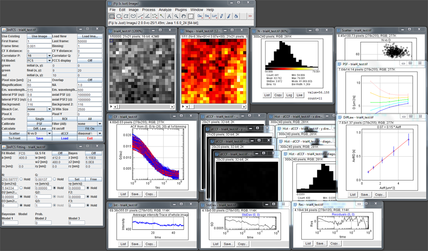

[](https://github.com/Biophysical-Fluorescence-Laboratory/Imaging_FCS/actions/workflows/build_and_release.yml)
[](https://github.com/Biophysical-Fluorescence-Laboratory/Imaging_FCS/releases)

# Imaging FCS :microscope:

<p align="center">
    
</p>

*Imaging FCS* is an *ImageJ* plugin featuring post-processing tools to calculate
and view spatio-temporal correlation functions from 16 bit grey tiff stack
files as well as data acquisition software for real-time image analysis. It was
written as a *FIJI plugin* (`ImageJ 1.53f`; `Java 1.8.0_281`).

*Imaging FCS* provides a comprehensive software tool to calculate and evaluate
spatiotemporal correlation functions. It includes the calculation of all auto-
or cross-correlation functions for arbitrary pixel binning and regions of
interest within an image, provides fit functions for total internal reflection
fluorescence (TIRF) and single plane illumination microscopy (SPIM) based FCS
measurements, can calculate the FCS diffusion laws and contains an essential
simulator to create simulated data for different diffusive modes.

ImagingFCS runs under ImageJ, FIJI and Micromanager, and it runs on PC, Linux,
and Mac OS. We will always use FIJI in the following text, but it should be
understood that the same is true for ImageJ and Micromanager.

## Installation

### Installation from the *ImageJ update site*

The easiest way to install *Imaging FCS* is by using the *ImageJ* update site. In
*ImageJ* chose `Help->Update`. This opens the `ImageJ Updater` window. Click on
`Manage update sites`.

Please tick both `Image Science` and `ImagingFCS`. Then close the
`Manage update site` window and click `Apply Changes` in the `ImageJ Updater`
window.

### Manual installation

#### Download on [Github Releases](https://github.com/Biophysical-Fluorescence-Laboratory/Imaging_FCS/releases/latest)

You can directly download the jar file from the GitHub releases page and move
the file in `fiji_root/plugins/` (here `fiji_root` is the location of your fiji
root). It will work on Windows, Linux and MacOS without additional features
(GPU and camera readout).

If you want to add these features, follow these steps:
  - Linux: Download `linux-libs.zip` from the
  [last release](https://github.com/Biophysical-Fluorescence-Laboratory/Imaging_FCS/releases/latest).
  In this archive, you can find the file `libagpufit.so` that you can move in
  `fiji_root/jars/gpufitImFCS-cublas` to support GPU operations. The camera
  readout features are not compatible with Linux.

  - Windows: For the camera readout features, you can download
  `windows-libs.zip` from the
  [last release](https://github.com/Biophysical-Fluorescence-Laboratory/Imaging_FCS/releases/latest)
  and move the `.dll` file to `fiji_root/jars/liveImFCS-SDK`. For the GPU
  operations you have to compile the library yourself and move it to
  `fiji_root/jars/gpufitImFCS-cublas`.

  - MacOS: MacOS does not support camera readout or GPU features.

#### Manual compilation

To compile the `.jar` file, you need to have *Maven* and *JDK 8* installed and
then you can simply run from the root of the project:

```sh
mvn clean package
```

You can then find the `.jar` file in the `target` folder and move it to
`fiji_root/plugins`.

If you need to compile the libs, you have to install *CMake* and *CUDA Toolkit*
(only to compile gpufit). If the CMake doesn't find CUDA it will not run this
part. Moreover, if you're not on Windows, it will not compile the camera
readout part.

If everything is installed on your side, you can run:

```sh
mvn clean package -DcompileLibs=true
```

It will build the libraries and output it in `src/main/cpp/build`. You can find
your library files there and move them to `fiji_root/jars/gpufitImFCS-cublas`
and `fiji_root/jars/liveImFCS-SDK`.

## Updating the codebase

### C++ / CUDA

If you want to add files, you will need to update the `CMakeLists.txt` in the
current folder. Moreover, if you want to add a JNI function, you will need to
update the Java code as well and generate a new header file for your code.

To generate the header files, run:

```sh
mvn clean package -DgenerateJniHeaders=true
```

The output files will directly be at the right location in the project.

### Java

You can create or update files and the compilation should not change and work
the same way as before.

## What's new?

This version includes ImFCSNet and FCSNet inference. ImFCSNet predicts
diffusion coefficient directly from intensity traces. FCSNet predicts diffusion
coefficient from autocorrelation function.

## ImFCS documentation 1_62.pdf

This manual contains the basic instructions on using the program, the
definition of all items in the control and fit panels, the file formats of the
saved data, and the theoretical functions used for fitting.

# References

**(Deep learning)** Tang WH, et al. "Deep learning reduces data requirements
and allows real-time measurements in Imaging Fluorescence Correlation
Spectroscopy."
bioRxiv. 2023. https://doi.org/10.1101/2023.08.07.552352

**(Direct camera readout)** Aik DYK, et al. "Microscope alignment using
real-time Imaging FCS."
Biophys J. 2022. https://doi.org/10.1016/j.bpj.2022.06.009

**(GPU capabilities)** Sankaran J, et al. "Simultaneous spatiotemporal
super-resolution and multi-parametric fluorescence microscopy."
Nat Commun. 2021. https://doi.org/10.1038/s41467-021-22002-9

**(Correlator scheme)** Sankaran K, et al. "ImFCS: a software for imaging FCS
data analysis and visualization."
Opt Express. 2010. https://doi.org/10.1364/OE.18.025468

## Disclaimer

The software and data on this site are provided for personal or academic use
only and may not be used in any commercial venture or distributions. All files
have been virus scanned, however, for your own protection; you should scan
these files again. You assume the entire risk related to your use of this
software and data. By using the software and data on this site your expressly
assume all risks of data loss or damage alleged to have been caused by the
software and data. The Biophysical Fluorescence Laboratory at NUS is providing
this data "as is," and disclaims any and all warranties, whether express or
implied, including (without limitation) any implied warranties of
merchantability or fitness for a particular purpose. In no event will the
Biophysical Fluorescence Laboratory at NUS and/or NUS be liable to you or to
any third party for any direct, indirect, incidental, consequential, special or
exemplary damages or lost profit resulting from any use or misuse of this
software and data.
