  -----------------------------------------------------------------------
  National university of singapore
  -----------------------------------------------------------------------
  Imaging FCS

  A plugin for ImageJ

  **November 2, 2023**
  -----------------------------------------------------------------------

{width="6.235078740157481in"
height="3.3959284776902887in"}

  -----------------------------------------------------------------------
  Imaging_FCS 1.613 is a basic ImageJ plugin to calculate and view
  spatio-temporal correlation functions from 16 bit GRAY TIFF STACK
  files. It was written under FIJI (ImageJ 1.53f; Java 1.8.0_281) using
  the math library commons-math3-3.6.1 and requires ImageScience.jar for
  statistical functions and Apache Poi for file reading and writing. It
  calculates correlations for each pixel or group of pixels in the image
  along the time axis (which is the z-axis in the stack). It contains a
  wide range of functions including, bleach correction, point spread
  function (PSF) calibration, and calculation the mean square
  displacement, among others including direct access to camera for
  real-time Imaging FCS.
  -----------------------------------------------------------------------

  -----------------------------------------------------------------------

# Contents {#contents .TOC-Heading .unnumbered}

[1. Introduction [2](#introduction)](#introduction)

[2. Calculating Correlations
[9](#calculating-correlations)](#calculating-correlations)

[3. Data Fitting [14](#data-fitting)](#data-fitting)

[4. Dual-Colour Fluorescence Cross-Correlation Spectroscopy (DC-FCCS)
[20](#dual-colour-fluorescence-cross-correlation-spectroscopy-dc-fccs)](#dual-colour-fluorescence-cross-correlation-spectroscopy-dc-fccs)

[5. Calibration of the lateral Point Spread Function (PSF)
[22](#calibration-of-the-lateral-point-spread-function-psf)](#calibration-of-the-lateral-point-spread-function-psf)

[6. FCS diffusion law [23](#fcs-diffusion-law)](#fcs-diffusion-law)

[7. Mean Square Displacement - MSD
[24](#mean-square-displacement---msd)](#mean-square-displacement---msd)

[8. Thresholds for fit results
[24](#thresholds-for-fit-results)](#thresholds-for-fit-results)

[9. Number and Brightness analysis (N&B)
[26](#number-and-brightness-analysis-nb)](#number-and-brightness-analysis-nb)

[10. Data table [28](#data-table)](#data-table)

[11. Saving and loading data
[28](#saving-and-loading-data)](#saving-and-loading-data)

[12. Batch Mode [29](#batch-mode)](#batch-mode)

[13. Direct Camera Readout
[31](#direct-camera-readout)](#direct-camera-readout)

[14. Exiting the plugin [38](#exiting-the-plugin)](#exiting-the-plugin)

[15. Checking Progress [38](#checking-progress)](#checking-progress)

[16. Theoretical ACFs and Simulations
[38](#theoretical-acfs-and-simulations)](#theoretical-acfs-and-simulations)

[17. Known Issues [38](#known-issues)](#known-issues)

[18. Changes to ImagingFCS
[39](#changes-to-imagingfcs)](#changes-to-imagingfcs)

[19. Acknowledgements [44](#acknowledgements)](#acknowledgements)

[Annex 1: Control Panel "ImFCS" Element
[45](#annex-1-control-panel-imfcs-element)](#annex-1-control-panel-imfcs-element)

[Annex 2: Fitting Functions
[51](#annex-2-fitting-functions)](#annex-2-fitting-functions)

[Annex 3: Mean Square Displacement
[56](#annex-3-mean-square-displacement)](#annex-3-mean-square-displacement)

[Annex 4: Simulation [59](#annex-4-simulation)](#annex-4-simulation)

[References [62](#references)](#references)

**\
**

# Introduction[^1]

**1.1 What does Imaging FCS 1.613 do?**

Imaging FCS 1.613 is an ImageJ plugin that allows calculating
spatio-temporal auto- and cross-correlations of an image stack (16 bit
gray value TIFF). It can perform the following tasks:

1.  Calculation of the temporal autocorrelation function (ACF) either at
    each pixel (or rectangular areas produced by m*×n* binning) of an
    image. Or at any manually selected region of interest (ROI).

2.  Calculation of the spatio-temporal cross-correlation function for
    any two pixels (or rectangular areas produced by *m×n* binning or
    manually selected ROIs) of an image. This can also be used for
    dual-colour fluorescence cross-correlation spectroscopy (DC-FCCS) if
    the image is split on the camera according to wavelength (fit models
    for both cases are provided).

3.  Perform different bleach corrections of the data.

4.  Analysis of the correlations by fitting with the appropriate fit
    function (1). The program can fit auto-correlations, spatial
    cross-correlations (diffusion and transport), and dual-colour
    cross-correlations. Models can include 1 triplet and up to 3
    different diffusive components. We provide simple non-linear least
    squares or a more time consuming general least squares algorithms.

5.  Calculate Model probabilities of fit functions using Bayesian Model
    Selection (2-4).

6.  Possible fit models, with manually chosen parameters, can be
    visualized.

7.  Depiction of parameter maps (e.g. Diffusion coefficients, number of
    particles, flow velocities, χ^2^ values) from the fit results.

8.  Creation of histograms for the fit parameters.

9.  Production of scatter plots of fit parameter pairs to check for
    correlations and trends in the fit parameters.

10. Calibrating the point spread function (PSF) by using a freely
    diffusing sample (5).

11. Calculating the FCS diffusion law for an FCS image (6).

12. Produce dCCF plots (dCCF or ∆CCF: difference between forward and
    backward correlation functions between neighbouring pixels; (1, 7)).

13. The mean square displacement (MSD) can be calculated from the
    correlation function.

14. Saving of experimental data and reading and reconstitution of
    experiments. At the moment ImFCS does not support backward
    compatibility for reading data.

15. Simulations of data in 2D and 3D are supported. Domains and
    meshworks can be simulated in 2D

16. Store and read configuration file for the user convenience of
    loading experimental parameters specific to a workflow.

17. Generate parameter video maps from an imagestack.

18. Direct access to camera for real-time Imaging FCS.

Please note, Imaging FCS does not calculate pure spatial correlations;
all correlations are always performed in time.

**1.2 GPU capability**

GPU mode is introduced in Imaging FCS version 1.52 which enables
computation of ACF, CCF, polynomial bleach correction, Number &
Brightness analysis, diffusion law and PSF calibration to be done on an
NVIDIA GPU. The code currently runs on 64-bit Windows and Linux. We
tested on Windows 10, Ubuntu 18.04 and Elementary OS 5.

As of version 1.61 and onwards, the Java library gpufitImFCS.jar is
bundled along with the main plugin. Hence, the compiled plugin
(Imaging_FCS_1_613.jar) needs to be in plugins folder in Fiji.app. In
terms of utilization, it is seamless to the user because the code will
perform necessary background checks to determine if a computation can be
done on a GPU. Furthermore, if an error is encountered while running a
computation on GPU, the process will switch to a CPU automatically and a
message is typically printed on Fiji.app console window for information.

We adapted and expanded the fitting code from *Gpufit: An open-source
toolkit for GPU-accelerated curve fitting* (8), which is available at
<https://github.com/gpufit/Gpufit>. We leveraged on this existing
framework to perform fitting of polynomial bleach correction and ACF
curves. Moreover, we added a CUDA kernel to perform ACF and CCF
computations. The gain in computation speed comes from the
parallelisation of calculations for each pixels onto GPU threads, which
otherwise is done sequentially on a CPU. We consolidated the CUDA and
Java codes into agpufit.cu and gpufitImFCS.java files respectively for
ease of compilation and distribution. The dynamic link library (.dll)
and shared object (.so) library files are generated from agpufit.cu
file, which are bundled together with the gpufitImFCS.jar file so that
the library can be loaded at runtime.

The bridge from Imaging FCS to CUDA code, which are written in C++, is
made possible through Java Native Interface (JNI). The JNI static
functions are coded in gpufitImFCS.java. In the Imaging FCS plugin,
pixels data are passed to GPU in an 1D array in order to speed up the
process. We observed that the JNI function *SetFloatArrayRegion* breaks
down when the output array size is large, which is why we hardcoded a
limit of 96 pixels x 96 pixels x 50000 frames for binning output size,
beyond which the binning operation will be done on CPU.

Calculations are parallelized in the GPU along the pixels. The GPU
kernel dimensions is set based on the dimension of output array. For
example, if binning or cross correlation is needed, the output dimension
is smaller than input image stack. The number of threads per block (a
dim3 parameter declared with a prefix "blockSize") is set at 16x16 in
agpufit.cu to avoid "too many resources requested for launch" error. On
the same token, please see function Info::configure() in agpufit.cu
also. The number of blocks per grid (a dim3 parameter declared with
prefix "gridSize") is set correspondingly.

We used nvcc compiler version 9.2 for compilation of CUDA codes. NVIDIA
driver should be kept up to date. For Windows users, a copy of
cublas64_92.dll is bundled in gpufitImFCS.jar. This cuBLAS library is
essential for fitting functions to run properly, as per the
documentation of Gpufit. Should you encounter an issue running the
calculations on the GPU, you may try installing CUDA Toolkit 9.2 or
newer, which would install necessary CUDA libraries to your computer.
Error messages and warnings are printed on Fiji.app console. If an error
is encountered while running on a GPU, the code will switch to the CPU
to perform the calculations automatically.

Do note that agpufit.dll and cublas64_92.dll would be loaded at runtime
in order for GPU codes to run on a Windows machine. For efficiency
reason, a subfolder called gpufitImFCS-cublas would be created in
Fiji.app, jars folder, where these dlls would be saved. In the event
these dlls could not be saved, they will be placed in the system Temp
folder whenever the plugin is launched. For Linux, the shared object
library is named libagpufit.so. It is statically linked to cublas_static
during compilation. Similarly, it is saved to a subfolder
gpufitImFCS-cublas or in the system tmp folder.

The numerical calculations by CPU and GPU are similar. A comparison of
computed ACF values and average diffusion coefficients for the bilayer
file for example:

  -------------------------------------------------------------------------------------
  **Settings**          **Largest       **Diffusion                           
                        difference in   coefficient                           
                        computed ACF    (μm^2^)**                             
                        values**                                              
  --------------------- --------------- ------------- --------- ------------- ---------
                                        **Average**             **Standard    
                                                                Deviation**   

                                        **CPU**       **GPU**   **CPU**       **GPU**

  Default: cfX = 0,     8.722 x 10^-9^  0.4094        0.4094    0.1994        0.1994
  cfY=0, binning = 0x0,                                                       
  bleach correction =                                                         
  none                                                                        

  cfX = 1, cfY = 1,     2.064 x 10^-6^  0.6715        0.6716    0.3105        0.3093
  binning = 2x2,                                                              
  polynomial bleach                                                           
  correction = 4                                                              

  cfX = 0, cfY = 0,     1.922 x 10^-6^  0.9711        0.9657    0.4311        0.4256
  binning = 5x5,                                                              
  polynomial bleach                                                           
  correction = 6                                                              
  -------------------------------------------------------------------------------------

A comparison between the execution times for files of different sizes in
the CPU and GPU is provided below The files had already been loaded in
ImFCS using the "load" button before measuring the execution time in the
CPU and GPU. The tests are done on a computer operating Windows 10
v18.09 with Intel Core i7-7800X CPU @ 3.50 GHz, 32GB of RAM and a NVIDIA
Titan XP GPU of 12GB of memory unless otherwise specified.

The execution time taken to calculate the autocorrelations with
polynomial bleach correction, fit the autocorrelations and display the
parameteric maps:

  -----------------------------------------------------------------------
  **Number of Pixels**    **Execution time        
                          \[s\]**                 
  ----------------------- ----------------------- -----------------------
                          **CPU\***               **GPU\***

  4                       0.4                     1.8

  441                     21                      3.4

  3600                    252                     6.3

  8100                    444                     9.3

  16384                   921                     17.2
  -----------------------------------------------------------------------

\* The tests are done on a computer operating Windows 10 v18.09 with
Intel Core i9-10900KF CPU @ 3.70 GHz, 64GB of RAM and a NVIDIA RTX 3090
GPU of 24GB of memory.

The execution time taken to calculate diffusion law:

  -----------------------------------------------------------------------
  **Number of Pixels**    **Execution time        
                          \[s\]**                 
  ----------------------- ----------------------- -----------------------
                          **CPU^\#^**             **GPU^\#^**

  100                     13.9 ± 0.3              15.85 ± 0.02

  3136                    539.6 ± 1.4             68.4 ± 0.4

  6384                    1051.8 ± 10.1           123.0 ± 0.5
  -----------------------------------------------------------------------

The execution time taken to calculate N&B:

  -----------------------------------------------------------------------
  **Number of Pixels**    **Execution time        
                          \[s\]**                 
  ----------------------- ----------------------- -----------------------
                          **CPU^\#^**             **GPU^\#^**

  3136                    39.65 ± 0.06            9.20 ± 0.02

  6384                    81.4 ± 0.1              17.8 ± 0.1
  -----------------------------------------------------------------------

^\#^ The files were analysed 3 times to obtain the mean execution time
along with its standard deviation.

The breakdown of time taken for correlation, JNI passing time, and
fitting for CPU and GPU mode of 128 $$ 128 pixels at various frames:

  ----------------------------------------------------------------------------------------
  **Number of     **CPU execution               **GPU                        
  frames (128**   time**                        execution                    
  $$ **128)**     **\[s\]\***                   time                         
                                                \[ms\]\***                   
  --------------- --------------- ------------- ------------ --------------- -------------
                  **Correlate**   **Fitting**   **JNI        **Correlate**   **Fitting**
                                                passing**                    

  100             0.3             373           11           39              1580

  500             1.1             120           7            86              1431

  1000            2.4             98            14           146             1289

  5000            13              119           70           572             562

  10000           26              113           152          1133            526

  50000           133             109           710          5263            561
  ----------------------------------------------------------------------------------------

\* The tests are done on a computer operating Windows 10 v18.09 with
Intel Core i9-10900KF CPU @ 3.70 GHz, 64GB of RAM and a NVIDIA RTX 3090
GPU of 24GB of memory.

**1.3 How to install the plugin?**

Imaging FCS works under ImageJ, FIJI, or Micromanager. In the rest of
the document we refer only to FIJI as Imaging FCS has been written under
FIJI. However, the same applies to ImageJ and Micromanager.

*1.3.1 Installation from the ImageJ update site*

The easiest way to install Imaging_FCS_1_613 is by using the ImageJ
update site. In ImageJ chose *Help-\>Update.* This opens the "ImageJ
Updater" window. Click on *Manage update sites*. To open the "Manage
update sites" window. Please tick both "Image Science" and "ImagingFCS".
Then close the "Manage update site" window and click "Apply Changes" in
the "ImageJ Updater" window.

Please note that the update site will also upload the latest Apache POI
files necessary for writing Excel files.

*1.3.2* *Manual Installation*

1.  You need a functional installation of ImageJ, Fiji, or Micromanager
    (the plugin was compiled under ImageJ 1.53f, Java 1.8.0_281
    (64-bit), using Apache Commons "commons-math3-3.6.1" math
    library[^2]), "poi-3.17", "poi-ooxml-3.17",
    "poi-ooxml-schemas-3.17", "imagescience",
    "commons-collections4-4.4", "poi-ooxml-schemas-3.17",
    "xmlbeans-5.1.3", "json-simple-1.1.1".

2.  You need to download and install Apache POI in the jars folder of
    Fiji (<https://poi.apache.org/download.html>). At the compile stage
    we use "poi-3.17" stable release. However, we had tested versions
    between 3.11 -- 3.17 and all worked equally well. These files are
    required for writing and reading .*xlsx* files.
    "commons-collections4-4.4", "poi-ooxml-schemas-3.17",
    "xmlbeans-5.1.3" are required to store metadata for data
    acquisition. "json-simple-1.1.1" is needed to store time-stamp
    during data acquisition step if any changes are performed.

3.  You need the Imaging_FCS_1_613.jar. Place the .jar files to plugins
    folders in Fiji.app.

4.  We provide the Java source file for your information. However, as
    Fiji updates relatively fast as the migration to ImageJ2 is
    happening, there can be compilation problems. But the .jar file
    should work. So, we suggest using the .jar file.

5.  We provide a 21x21 pixels test file measured on a fluorescently
    labelled lipid bilayer, which contains 20,000 frames and was
    recorded with 1 ms time resolution.

6.  If there are problems with loading/using images form the plugin,
    please switch SCIFIO off (see section 14. Known Issues).

To start Imaging FCS, install Imaging_FCS_1_613.jar in the "plugins"
folder of FIJI. On PCs you find this under "Fiji.app/plugins". On Macs,
go to the application folder and "*control-click*" the Fiji application.
Select "Show package contents" and copy the Imaging_FCS_1_613.jar to the
"plugins" folder. Then launch Fiji. You can start Imaging FCS under the
"*Plugins*" tab in FIJI.

*1.3.3 Compiling the files yourself*

Other ways to start Imaging FCS: You can compile the Java source file
yourself using the following steps.

To compile the CUDA code, you will need CUDA Toolkit 9.2 or newer
installed. Identify the CUDA library is located for instance, in
C:\\Program Files. Do check that your GPU driver is compatible with the
CUDA Toolkit version that is used. nvcc compiler is used to compile the
agpufit.cu file to agpufit.dll or libagpufit.so for Windows and Linux OS
respectively. Java Development Kit 8 (JDK) is also required. The path
variable JAVA_HOME points to the location of this Java JDK. You can
specify the NVIDA GPU architecture for which the code is compiled by
using the flag gencode. You can choose to make use of cuBLAS library,
which helps speeding up the fitting process, by including the flag -D
USE_CUBLAS, the file path to the cuBLAS library and flag -lcublas.

a)  For Windows, launch Command Prompt, navigate to the location of
    agpufit.cu and enter the following command:

> nvcc agpufitjni.cu -O3 -D USE_CUBLAS -rdc true -shared -o agpufit.dll
> -gencode arch=compute_35,code=\[sm_35,compute_35\]
> -I\"%JAVA_HOME%/include\" -I\"%JAVA_HOME%/include/win32\"
> -I\"C:\\Program Files\\NVIDIA GPU Computing
> Toolkit\\CUDA\\v9.2\\include\" -lcublas

b)  For Linux, launch Terminal, navigate to location of agpufit.cu and
    enter either of the following command:

> nvcc agpufitjni.cu -O3 -D USE_CUBLAS -rdc true -shared
> \--compiler-options -Wall \--compiler-options -fPIC -o libagpufit.so
> -gencode arch=compute_35,code=\[sm_35,compute_35\]
> -I\"\$JAVA_HOME/include\" -I\"\$JAVA_HOME/include/linux\"
> -L\"/usr/lib/x86_64-linux-gnu\" -lcublas_static -lculibos

To compile Direct Camera Readout C++ source code, Java Development Kit 8
(JDK) is required to generate C++ header file from AndorSDK2v3.java,
AndorSDK3v2.java, Hamamatsu_DCAM_SDK4.java, Photometrics_PVCAM_SDK.java.
Subsequently, generate 4 cameras specific .dll (we recommends Visual
Studio 2019 IDE).

To compile the program in its entirety, we need Java Development Kit 8.
Let "builddir#" be the location where .class file will be placed,
"sourcedir#" will be the location where corresponding .java will be
placed and "outdir" be the output directory where Imaging_FCS_1_613.jar
will be placed. There are 5 such java files: GpufitImFCS.java,
AndorSDK2v3.java, AndorSDK3v2.java, Hamamatsu_DCAM_SDK4.java, and
Photometrics_PVCAM_SDK.java

1)  To compile GpufitImFCS.java to GpufitImFCS.class:

> javac -d "builddir1" "sourcedir1"\\GpufitImFCS.java

2)  Repeat for 4 others .java

3)  Copy corresponding .dll and/or .so to "builddir1", "builddir2", ...
    "builddir5" respectively.

4)  Compile Imaging_FCS_1_613.java to generate Imaging_FCS_1_613.jar,
    run:

> jar cf "outdir"\\Imaging_FCS_1_613.jar -C "builddir1"; "builddir2";
> "builddir3"; "builddir4"; "builddir5";

Repeat only step 4) for changes to source code other than GPU and Direct
Camera Readout related.

You can also use a Java IDE (e.g. Netbeans, Eclipse, JSource etc.; we
tried only Netbeans up to now but that worked fine).

***Note:** Do not install the .jar file and try running the Java file in
Fiji at the same time. This can lead to some errors in the execution. We
suggest to just using the .jar file.*

**1.4 Starting the plugin and loading images**

After you started the program, you will see the ImFCS control panel:

{width="3.237817147856518in"
height="2.9395975503062117in"}

**Fig. 1.1:** ImFCS Panel. The description of all parameters is given in
Annex 1 "Control Panel 'ImFCS' Elements". Note that the title of the
control panel contains also the name of the image (here
"trial4_test.tif") which was used at that moment by the plugin.

*1.4.1 Loading an Image*

Click the "*Load*" button on the upper right. A dialogue will appear
that will let you load any image stack. Make sure the image stack you
load is a [16 bit GRAY TIFF STACK file]{.underline}.

*1.4.2 Use an existing Image*

In case the image stack you want to analyse is already open in FIJI,
click on that window to make sure it is the uppermost window and then
click the "*Use*" button. The image will then be resized and placed
along the ImFCS control panel for further use.

*1.4.3 Required Parameters*

{width="2.9856178915135607in"
height="2.2664545056867893in"}

**Fig. 1.2:** Experimental Settings Panel. The description of parameters
pertinent for fitting curve fitting.

The plugin reads in the basic information from the file, including the
number of frames, dimensions of the frames (not shown in the plugin but
shown by ImageJ), background value (the lowest counts found in the
entire stack; for other correction see chapter 9 for number and
brightness analysis). However, experimental parameters have to be
properly entered for the fit information to make sense. This includes
the following: *Frame time, Pixel Size, Magnification, NA, Emission
wavelength, lateral PSF, axial PSF*. The definition of all these
parameters is given in Annex 1. In the case of two-colour measurements,
*Emission wavelength 2, lateral PSF 2, axial PSF 2* have also to be
provided. The values for the axial PSF can be obtained by measuring the
light sheet thickness (1/e^2^ value, see Annex 1). The lateral PSF can
be obtained by a calibration measurement and using the *Calibrate PSF*
function of the plugin (see section 5). Toggle "*Exp Set"* to make
changes to *Pixel size, Magnification, NA, Emission wavelength, and
PSFs.*

**1.5 Starting multiple instances of the plugin**

Fiji allows running multiple instances of the same plugin. This means
one can run the Imaging FCS plugin several times and in each use a
different image. To make differentiating between the windows possible,
each window of the plugin carries its title plus the title of the image
loaded. E.g., in Fig. 1.1 the control panel is called "ImFCS". In Fig.
1.3, the name "trial4_test.tif" has been added to yield "ImFCS --
trial4_test.tif" to indicate that the control panel uses the image stack
"trial4_test.tif". The same will be true for all other windows
(correlation functions, parameter maps etc.). The "*To Front*" button of
the plugin allows bringing all windows connected to that panel to the
front.

{width="4.61719050743657in"
height="2.51372375328084in"}

**Fig. 1.3:** After selecting a file with "Use Image" or "Load image",
the selected image is adjusted in size and placed alongside the ImFCS
Panel. The ImFCS panel is renamed to contain the image name.

# Calculating Correlations

1.  **Performing individual correlation analysis**

After the image stack is loaded, perform one of the following two
actions to calculate the correlations as specified within the Control
panel (for details on the different options see below):

1.  Use the mouse to click any pixel within the image and the program
    will calculate and depict the correlation, standard deviation, and
    intensity trace.

2.  If you have a number pad, you can use the "2", "4", "6", and "8"
    keys to move within the image (the number or cursor keys don't work
    as they have already other uses in FIJI).

You should see the correlation and intensity trace windows as on the
left in Fig. 2.1. In addition, the standard deviation (SD) of the
autocorrelation function is depicted. As the ACF is the mean value of
many individual intensity/photon count products, the standard deviation
of the ACF is calculated as the standard error of the mean of these
products (9) and is then corrected by a blocking procedure (3).

{width="5.617766841644794in"
height="4.0076224846894135in"}

**Fig. 2.1:** Correlation functions and intensity trace. On the left the
correlation is performed on the raw data. On the middle side a "sliding
window" bleach correction has been applied. On the right side is
"polynomial 4^th^ order" correction applied to the intensity trace. Note
that the intensity trace is the same (for more information see the
text). The standard deviation in the lower panels is the standard
deviation calculated for the correlation functions.

1.  **Bleach Correction**

If bleaching is present, the data can be corrected by one of four
methods.

1)  Either a sliding window approach can be used. In this case, the
    total intensity trace for each pixel is divided into subsets. The
    correlation is then performed on each subset and the results are
    averaged. Note, that this will reduce the overall time available for
    correlations (the correlator P and Q values are automatically
    adjusted by the program) and increase the variance especially at
    long times making fitting of slow particles and possibly G, i.e. the
    correlation value at long times, more difficult. As default, the
    traces are divided into 20 subsets. However, the program will
    provide a general dialog when choosing *Sliding Window* as bleach
    correction, asking for the sliding window size. The panel on the
    right in Fig. 3 shows the ACF of the left panel after a sliding
    window bleach correction. Note that the SD changes accordingly.
    However, the intensity trace stays the same as it is not corrected.

***Note**: If the sliding window is narrow and cannot cover enough time
to allow the calculation of a full correlation function, then the
results of the fits will be biased (6).*

{width="4.522335958005249in"
height="4.801913823272091in"}

**Fig. 2.2:** Single and double exponential bleach corrections. The data
is the same as in Fig. 3 for comparison of the three bleach correction
approaches.

2)  In addition to the sliding window approach, the data can also be
    corrected by a single or double exponential fit to the intensity
    trace (see Fig. 2.2). In that case the intensity trace is corrected
    by a single or double exponential fit, which is reflected in the
    change of the intensity trace plot. The data chosen for Fig. 2.2 is
    the same as for Fig. 2.1 for better comparison.

3)  The third method is fitting the data by a polynomial fit. When this
    is selected, then the user is asked for the degree of the
    polynomial. In our experience a degree in the range of 4 to 8 is
    sufficient for bleach correction. The polynomial degree should not
    be selected too high as otherwise the correction can influence also
    the fast fluctuations which are investigated and the resulting
    diffusion coefficients will be biased.

4)  The last method is correction by line segments. In this case the
    user will be asked for a window length. The intensity trace will be
    divided in stretches of that window length and the intensity will be
    corrected with a liner fit.

Except the exponential corrections, all other methods can take account
of general slow fluctuations, and not only bleach decays. The sliding
window approach, however, as it uses subsets of the total measurement
can lead to distortions and biases of results (10) if the subsets are
too small. So sliding window approaches should be used for long data
sets and for sets which show changes other than just bleaching. The
polynomial and line segment corrections are the most widely used
approaches at the moment, especially when fluctuations are seen that are
not only due to photobleaching (11).

1.  **Performing analysis of regions of interest or the whole image**

To calculate all correlations simultaneously click the button "*All*" on
the lower right. It will take \~19 seconds in CPU or 3 seconds in GPU to
calculate all correlations for a 21x21 image. Larger or smaller images
will take less or more time accordingly. Note that now the intensity
trace shows the average intensity of the whole image:

{width="2.6805555555555554in"
height="2.6805555555555554in"}

**Fig. 2.3:** All correlations calculated for a 21x21 pixels image. Here
a sliding window bleach correction was used. It took \~ 3 seconds (GPU)
and 19 seconds (CPU) for the calculation of all ACFs.

Below the "*All*" button you can chose a possible filter. The default is
"*none*". If you chose "*Intensity*" or "*Mean*", you will be asked to
provide upper and lower thresholds for the intensity (of the first
frame) or for the mean intensity value. The filter dialogue will pop up
each time you press the "*All*" button (Fig. 2.4). Only pixels whose
intensity/mean intensity falls between these thresholds will be

{width="1.5090277777777779in"
height="1.3581244531933507in"}

**Fig. 2.4:** Selection of lower and upper threshold for pixel
intensities/mean intensities as a selection filter for which pixels
ought to be correlated.

correlated. This feature is useful if one wants to avoid fitting
background pixels. This speeds up the calculations and reduces fitting
problems as background pixels have no correlations and the fit will
return meaningless values (and sometimes can hang the program for longer
times).


**Fig. 2.5:** Correlations and parameter map calculated for an arbitrary
ROI within a 21x21 pixels image.

The same procedure can be applied to regions of interest (ROIs). Just
select a ROI in the image by using the ROI tools of FIJI and then press
the button "*ROI*" (Fig. 2.5). Filters can be set in the same way as for
the "*All*" button.

2.  **Average correlation functions**

When pressing the button "Average" on the main panel, the average
correlation function of all valid pixels will be calculated. Valid
pixels can mean two different things. First, if "fit" is switched off,
then all pixels that were correlated are valid, others that were not
correlated by the user are invalid. Second, if "fit" is switched on,
then only those pixels are valid that had a converged fit and which fall
within the thresholds, if any were set, are valid. An individual pixel
can be set to invalid status if it is double clicked in the parameter
map window. If "fit" is switched on, the average FCS is also fitted. The
fit results are shown in the fit window. The average correlation
function is plotted in the Correlation Function plot window.

3.  **Difference in cross-correlation functions (∆CCF or dCCF)**

The difference in cross-correlation functions (∆CCF or dCCF) is the
integrated difference between the forward and backward correlation
functions between two spatially different areas. It contains information
about active transport of molecules and sample heterogeneity (1, 5, 7):

$\mathrm{\Delta}CCF = \int_{0}^{T}\left( {CCF}_{AB}(\tau) - {CCF}_{BA}(\tau) \right)d\tau$

In the case of diffusion the mean value of the dCCF is close to 0. In
the case of flow or active transport the dCCF is positive or negative
depending on the dCCF direction and the flow/transport direction. The
width of the distribution is a measure of the heterogeneity.

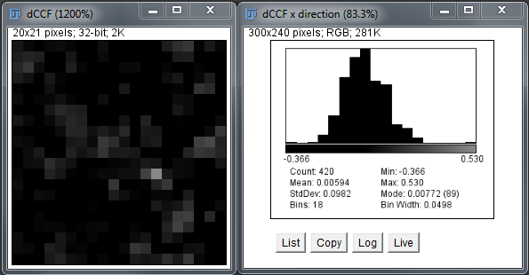{width="4.208333333333333in"
height="2.1925765529308836in"}

**Fig. 2.5:** dCCF image calculated in the x direction. Note that the
dimension of the original image was 21x21 pixels. But as the dCCF has
been calculated in the x direction it contains now 20x21 pixels only. On
the right side the dCCF histogram is shown.

# Data Fitting

4.  **The Fit panel**

To fit the data press the "*Fit*" button. This is a toggle button that
switches data fitting on or off. When switched on a Fit parameter window
is shown which carries the title "*ImFCS Fitting*":

{width="3.2966076115485565in"
height="3.320670384951881in"}

**Fig. 3.1:** Fit parameter window "ImFCS Fitting".

There are now two possibilities for fitting data. One can use either a
weighted non-linear leased squares (NLS) fit or a generalized least
squares (GLS) fit. One can chose between the two by switching the GLS
button on or off.

The NLS fit is a weighted fit, where the weight is given by the standard
deviation (SD) of the correlation functions. The SD is now calculated by
the blocking transform (3). For the GLS fit the covariance matrix is
calculated from the blocked correlation data and is regularized ((3) and
references therein).

If the button "*Bayes*" is switched on then the program fits a one- and
a two-component model to the data and calculates the model probabilities
of each model. The results will be given in the Bayesian Model
Probability section at the bottom.

The "*Test*" button allows to draw a theoretical correlation function
with the parameters as provided in the fit window. So one can adjust
these parameters manually and see how they change the correlations
function.

We have introduced a "*Free/Fixed*" toggle button. The *Fixed* selection
sets the current fit parameters as fixed and all fits always start with
these starting values. Each time toggle button is set to *Fixed* the fit
parameters are set new to the current values. To undo that the
"Free/Fixed" button can be clicked. If it is set to free, then each fit
starts with the resulting fit parameters from the last fit. This is
useful where the correlation functions have a trend to shift over the
image so that the first and last pixel have very different values but
there is a smooth transition for the pixels in between

Note that the values for *a, w, w2, z, z2, rx, ry* and *rz* are
calculated from the parameters given in the ImFCS Panel and they cannot
be edited by the user. If these parameters need to be changed, change
the parent parameters (*Pixel size, magnification, PSF (xy), PSF2 (xy),
PSF (z), PSF2 (z), λ~1~, λ~2~, NA , binning, CF X distance, CF Y
distance*) in the ImFCS Panel.

The definition of these parameters are explained here:

**Fit Model:** This can be either "FCS" or "DC-FCCS"

**GLS Fit:** Switch between weighted NLS or GLS fits.

**a \[nm\]**: pixel size in image space, defined as

*Pixel size/magnification*

**w \[nm\] and w2 \[nm\]**: 1/e^2^ radius of the lateral PSF. This is
calculated from

*PSF (xy) \* λ~1~ / NA* or *PSF2 (xy) \* λ~2~ / NA*

**z \[nm\] and z2 \[nm\]:** 1/e^2^ radius of the light sheet thickness
profile (this is typically measured and has to be input into the program
as the *PSF (z)* or *PSF2 (z)* value).

*PSF (z) \* λ~1~ / NA* or *PSF2 (z) \* λ~2~ / NA*

**rx \[nm\]**: Distance in x direction between pixels to be correlated.
This is calculated from

*CF X distance \* Pixel size \* binning / magnification*

**ry \[nm\]**: Distance in y direction between pixels to be correlated.
This is calculated from

*CF Y distance \* Pixel size \* binning / magnification*

**rz \[nm\]**: This is a possible shift of the two light sheets against
each other in DC-FCCS. This is qualitatively different from the rx and
ry values which just describe the distance of the pixels to be
correlated. rz accounts for a possible misalignment of the light sheets
in z-direction.

**Fit parameters:**

All fit parameters can be either free or fixed (see the radio buttons
called "*hold*"). By setting certain parameters to 0 and clicking hold
at the same time, one can use different fit models (diffusion only, flow
only, diffusion and flow, one component, two components etc.).

**N**: Number of particles in observation area or volume. Note that this
parameter makes no strict sense in terms of particle numbers for spatial
cross-correlations.

**G**: Convergence value of the correlation function for long times.
This is expected to be 1. Deviations from 1 can indicate problems with
bleaching. After bleach correction this values should be close to 1.

**D, D2, D3**: Diffusion coefficients of species 1, 2 and 3.

**vx** and **vy**: flow speeds in x and y directions. If no flow is to
be fitted, they can be set to 0 and put on hold. Note, at the moment
only one flow component (vx, vy) is allowed. So it is assumed that even
if several particle species are present, they can have different
diffusion but have the same flow.

**F2, F3**: Fraction of species 2 or 3 if present; one can set these
selectively to 0 and put on hold for one-, two-, or three-component
fits. The fraction of species 1 is F1 = 1 -- F2 -- F3.

**Q2, Q3**: This is the brightness of the second and third particle in
respect to the first particle. For a proper fit this needs to be known
and the correct values have to be entered here. E.g. if the second
particle is 50% brighter, this value has to be set to 1.5. If the value
is set incorrectly the fit will give wrong values for F2. The same is
true for Q3 and F3. If one of the components is set to 0 (F = 0 and put
on hold) then the corresponding Q parameter has no influence.

**Ftrip**: Fraction of molecules in a triplet state.

**Ttrip**: Characteristic time of the triplet.

After the parameters have been set one can then click on any pixel in
the window to obtain the correlations and the fit. When a fit is
performed, the residuals will be plotted in an additional window below
the intensity trace window. After fitting the function for one pixel you
should see any of the following windows:

**Fig. 3.2:** Data fit. The program shows the fit with the correlation
function in the "Correlation Function Display" and creates plots for the
standard deviation of the ACF, residuals, intensity trace, blocking
results and covariance matrix. Note that the blocking and covariance
matrix are not shown by default but have to be selected under "Options".
The covariance matrix is only calculated for GLS fits

{width="3.994676290463692in"
height="2.7952996500437446in"}

Which of these windows are actually shown depends on the selection in
"*Options*" in the main panel. By default the ACF, SD, Residuals, and
Intensity trace are shown. But the blocking and covariance matrix (only
for GLS fits) can be shown. To choose options press the "*Options*"
button in the main panel:

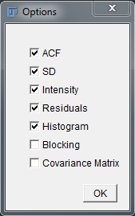{width="1.338176946631671in"
height="2.1458333333333335in"}

**Fig. 3.3:** Options window to select which data to show.

In addition, a new stack window with a parameter image map will be
opened as described in the next section.

If the "*ROI*" or "*All*" button is pressed all relevant pixels are
correlated and then fitted. Which pixels are fitted depends on binning
and whether one uses autocorrelations, spatial cross-correlations, or
dual-colour cross-correlations, and whether overlap is switched on or
off. [It is important that before pressing the "*ROI*" or "*All*" button
you check that you have sensible fit parameters in the Fit
panel]{.underline} as they will be used as starting values. If the
parameters are too far off, fitting can take longer and might result in
many pixels without fits as fits might not converge. If fits don't
converge a log window will be opened with a message giving the pixel at
which problems were encountered and what the problem was[^3]. For
membrane diffusion, a good start is mostly N = 1, D = 1 μm^2^s^-1^, and
G = 0 (all three free) and all other values 0 and on hold. You can
refine models and parameters subsequently. The correlation and fitting
on CPU takes about 40 seconds for a 20x20 pixel image with 50,000 frames
(MacAir 1.7 GHz Intel Core i5 or PC Intel i7-3770 3.4 GHz, 64 bit, 16 MB
RAM).

5.  **Binning and Overlap mode**

When binning is used, *n×n* pixels will be added together before the
correlation is calculated. Binning can be used to provide better signal
in some cases. In the case of binning the user can decide between two
modes, overlap and non-overlap by selecting the Overlap On/Off button.
In overlap mode neighbouring pixels will overlap while in the
non-overlap mode only non-overlapping pixels will be calculated and
correlated. The advantage of the overlap mode is that it provides more
correlation functions and that correlation functions can be calculated
for any position and any binning on the image. The non-overlap mode
always starts with the left upper most image point and thus allows only
certain pixels to be defined. At the moment the program allows only
square binning, i.e. *n×n* binning.

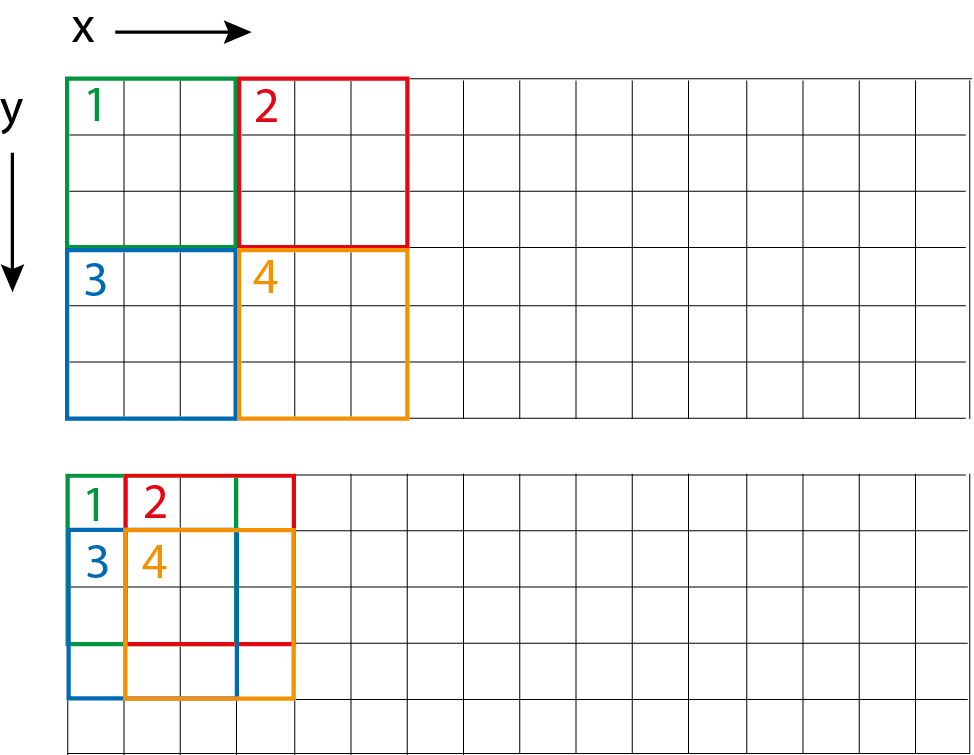{width="3.2466732283464568in"
height="2.516672134733158in"}

**Fig. 3.3:** Explanation of Overlap mode. In the upper panel four
pixels for 3×3 binning in non-overlap mode are shown. In the lower panel
the 4 pixels are shown in overlap mode.

6.  **Parameter Maps and the Histogram Window**

If fit is selected and a correlation is calculated a new stack window
with a parameter image map will be opened and a histogram window for the
parameters will be created. The parameter map window is a new stack
window that contains as many maps as there are parameters plus a map of
the χ^2^ values for all fits, and an additional map indicating whether
blocking was successful for the calculation of the standard deviation
(3)[^4]. Using the scrollbar at the bottom one can switch between the
different parameter maps. In the histogram window the corresponding
histogram to the selected parameter map is shown. However, histograms
are shown only for the [free fit]{.underline} parameters (including
χ^2^). The number of bins ($n_{bins}$) in the histogram are calculated
by the Freedman-Diaconis rule (12):

$$n_{bins}\  = \frac{\sqrt[3]{n_{points}}(Max - Min)}{2\ IQR}$$

Where the number of points are given by $n_{points}$, $Max$ and $Min$
are the maximum and minimum values, and $IQR$ is the interquartile
range.

Here is the map for the number of particles N shown (in this case all
correlation functions have been fitted to show a full map). The title
contains the name of the parameter plus its mean and standard deviation.

If single fits are performed, the data of these single fits will be
updated in these maps. This is useful if some of the batch fits are not
good and have to be individually refitted.

***Note:** If the fit parameters for one of the pixels are required,
click on that pixel in the parameter map window. The fitted parameters
will then be displayed in the ImFCS Fitting panel, and the correlation
function and its fit will be shown in the correlation function window.
If data from an ROI is required, draw an ROI in the parameter map and
the selected data will be shown. For filtering and removing data points
see the section on Thresholding.*

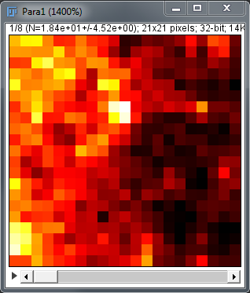{width="2.0902777777777777in"
height="2.451803368328959in"}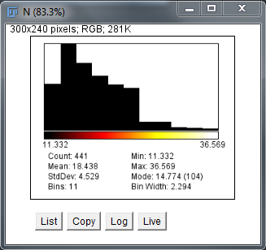{width="2.4182895888013998in"
height="2.2777777777777777in"}

**Fig. 3.4:** Parameter and histogram window.

Here we show the case in which all correlation functions have been
calculated and fitted. Note that the program calculates the correlations
each time new, so that any changes in parameters in the control panel
are taken into account. The exception here is binning as in this case
the whole map needs to be changed. The combined correlation and NLS and
GLS fits take each about 15 - 20 seconds for a 20x20 pixel image with
50,000 frames.

***Note:** If binning is changed, all existing fit results are
discarded, as the program at the moment does not support the use of
different binning simultaneously.*

You can remove single fits from the evaluation by double clicking that
pixel in the parameter map. This removes all fit values and correlations
but not the raw intensity data in the image. By clicking the same pixel
in the image the correlation and fit can be done again.

7.  **Scatter Plots**

Imaging FCS allows depicting scatter plots of parameters against each
other. This is useful to check for correlations between parameters.
Correlations between parameters can be a sign of problems in the fit
(e.g. the fraction and characteristic time can sometimes be correlated
if the data is not sufficient to distinguish between two different
particles/processes). But more importantly the correlation can also stem
from the sample. E.g. the diffusion coefficient and number of particles
can be correlated when in areas where there the concentration of
particles is high are also areas where the particles interact/bind or
the density is higher.

The program allows the depiction of 7 different scatter plots: "N vs D",
"N vs F2", "D vs F2", "N\*(1-F2) vs D", "N\*F2 vs D2", "D vs
(v~x~^2^+v~y~^2^)" and "D2 vs (v~x~^2^+v~y~^2^)".

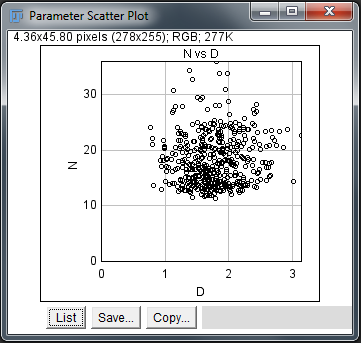{width="2.6805555555555554in"
height="2.5468996062992124in"} **Fig. 3.5:** Scatter Plot example of "N
vs D".

8.  **Recommendations for fitting**

We tested the weighted NLS and the GLS fits on simulations. Both fits
need a minimum number of frames to converge to the simulated diffusion
coefficient. This is about 50,000 frames for the NLS fit and somewhat
longer for the GLS fit. However, for the same number of frames the GLS
fit will have an about 20 - 30 % smaller standard deviation for the
diffusion coefficient. Bayesian Model Selection uses GLS fits and fits
multiple models. So it will take correspondingly longer and probably
should be used only in the final evaluation. In future versions we will
try to speed up the calculations.

# Dual-Colour Fluorescence Cross-Correlation Spectroscopy (DC-FCCS)

DC-FCCS measurements assume that the image was split according to
wavelength onto two parts of the image sensor. For DC-FCCS measurements,
please switch the fit model in the "Fit Model" field in the control
panel to "DC-FCCS". The distance between the "green" and "red" pixels
has to be provided in the "CF X distance" and "CF Y distance" fields of
the control panel.

Clicking onto any pixel within the green channel (green shaded area in
Fig. 4.1) will then provide the cross-correlation function in the
Correlation plot window. If one wants to depict both ACFs and the CCF
simultaneously, one can switch on the toggle button \"FCCS Display\". If
this button is set on "On", the cross-correlation is plotted in blue and
the ACFs in green and red. Switching on FCCS also automatically switches
the fit model to the DC-FCCS model.

For the calculation of multiple DC-FCCS functions, chose a ROI in the
region of the green channel, set the "CF X distance" and "CF Y distance"
and then press "ROI".

{width="2.8036253280839896in"
height="2.875in"}

**Fig. 4.1**: On the left is shown the principle for DC-FCCS. The green
and red shaded areas represent the images split according to wavelength
on a single array detector. The user has to provide the distances
between the green and red pixels. The program can calculate the
cross-correlation between the corresponding pixels then.

***Important:** Of course DC-FCCS can also be calculated for all
relevant pixels with fitting. However, you should first make sure that
there are cross-correlations. Otherwise, calculations can take long, as
the fits do not converge, and many fits will not provide fitting
parameters. In addition, make sure that the starting values in the Fit
panel are sensible (e.g. no negative numbers). If the starting values
are too far off, the fits will not converge (see also 3.1 Fit Panel).*

*Please also note that the "FCCS Display" mode is set to off if the
"All" button is pressed as that results in too many curves to be plotted
within one graph. In that case only all cross-correlation curves are
plotted, with their fits, if applicable, without the autocorrelations.*

{width="4.897342519685039in"
height="3.0124136045494314in"}

**Fig. 4.2:** Cross-correlation display in dual colour mode.

Besides fitting the three individual correlation functions for each
pixel, an additional quantity called cross-correlation amount (*q*) is
calculated. *q* is defined according to (13) as:


and provides a semi-quantitative measure of the fraction of co-diffusing
green and red particles. Theoretically, *q* is expected to assume values
between 0 (no cross-correlation) and 1 (complete cross-correlation).
However, due to imperfect fitting of noisy curves, values \> 1 or \< 0
can be occasionally encountered. Values \> 1 are usually caused by
errors in determination of *N* by fitting very noisy correlation curves,
especially in situation where ACF amplitudes are very low. Since such
values usually suffer from very large errors, they are excluded from
further analysis by setting *q* in such pixels to NaN. Values of *q* \<
0 can result from errors in fitting CCFs with amplitudes close to 0; *q*
can be set to 0 in such pixels by applying thresholds (see the
respective section)

# Calibration of the lateral Point Spread Function (PSF)

The program requires the axial dimensions of the PSF in the field
"*axial PSF \[um\]*" in the "*ImFCS*" control panel. The axial
dimensions, i.e. the 1/e^2^ radius of the light sheet, needs to be
measured and provided. If a 2D correlation is desired, the value can be
set to a large number (the default is 1000000) in which case the
thickness plays no role in the correlation and essentially a 2D fit is
performed (e.g. for imaging total internal reflection FCS or ITIR-FCS).

Once that is entered the user can press the Calibrate "*PSF*" button and
a small dialog will appear. This will ask the user first for a range of
PSF values to be used (start value, end value, step size).

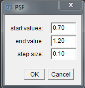{width="1.1271183289588802in"
height="1.1666666666666667in"} **Fig. 5.1:** PSF dialog.

Typically one should not use more than 5 parameter values at the same
time as the calculation can become slow (e.g. Start 0.7, end is 1.1,
step size 0.1). The program will then plot the diffusion coefficients
fitted by a simple one component model to the sample for binning values
from 1-5. As the diffusion coefficient is a constant the correct PSF
value should lead to a straight line.

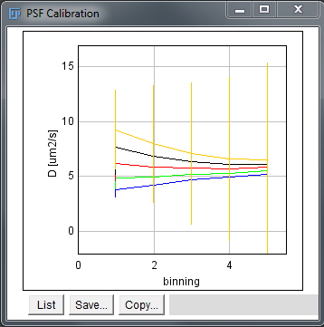{width="2.3139413823272093in"
height="2.3333333333333335in"}

**Fig. 5.2:** Plot to determine the PSF size.

# FCS diffusion law

The FCS diffusion law can also be calculated (5, 6). Pressing the button
"*Diff. Law*" in the control panel will plot the FCS diffusion law for
an FCS image. As this requires the calculation of correlations over the
whole image several times, this is a bit slower than e.g. fitting all
correlations in an image. Note also, that bleach correction can be
selected and will be taken into account in the calculations.

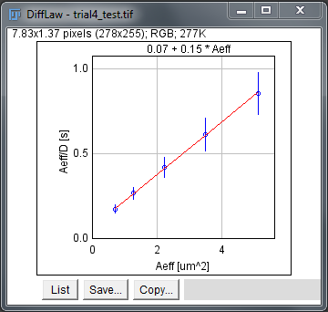{width="2.6534142607174105in"
height="2.5208333333333335in"}

**Fig. 6.1:** Diffusion law plot. Note that the results of the diffusion
law plot are given above the frame, here the line was best fit by 0.07 +
0.15\*Aeff.

When pressing the button "*Diff. Law*" a control panel will appear which
will allow choosing from which binning to which binning to calculate the
diffusion law. Note that the options will change if overlap or
non-overlap more is selected in the main panel. As in overlap mode many
more binned (but overlapping) pixels are available, more points can be
calculated in the diffusion law plots. However, one should take account
of the increasing standard deviation of points of larger binning. After
the calculation, the diffusion law plot can then be fitted with the
controls in the second row. The user can choose the start and end points
of the fit and fit the data by pressing "*Fit*". The fit results will be
shown in the Diff Law panel (Fig. 6.1).

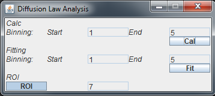{width="3.1698108048993876in"
height="1.4166754155730534in"}

**Fig. 6.2**: Diffusion law panel. The user can decide which binning to
use and afterwards can fit the data choosing start and end-points with a
linear fit.

The user can also calculate diffusion laws for small sub-regions of the
image (14). By clicking the button on the lower left the user can choose
between "*All*" and "*ROI*". When all is selected the diffusion law over
the whole image is calculated. When "*ROI*" is selected then the
diffusion law is calculated for each 7x7 pixel area of the image for
binning from 1-5. For the binning overlap mode is automatically assumed
to make sure there is sufficient statistics for the different points in
the diffusion law.

# Mean Square Displacement - MSD

When the MSD button is switched on, then the MSD is directly calculated
from the ACF (15) for the part of the ACF at which its value is at least
90% of its amplitude. This means the MSD is only calculated for the
first points up to about the diffusion time (i.e. the time a particle
needs to cross the observation volume). When switching MSD on, a
dialogue will appear and request whether 2D (ITIR-FCS) or 3D (SPIM-FCS)
MSD calculations are required. Note that for 3D (SPIM-FCS) MSD
calculations, the *sigmaZ* in the ImFCS panel has to be provided,
otherwise a fit error will be produced.

**Fig. 7.1**: MSD dialogue

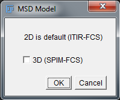{width="1.5208333333333333in"
height="1.2686362642169728in"}

The MSD is calculated by inverting the ACF. As this is non-trivial for
the Error Function, this is done numerically (see Annex 18). No fitting
procedures are provided as yet but the data is saved in the experimental
.*xlsx* files. Also note, that if the ACF contains photophysics or
triplet states or the area is non-square, the MSD for this part will
still be calculated, but these points should be excluded in any later
evaluation.

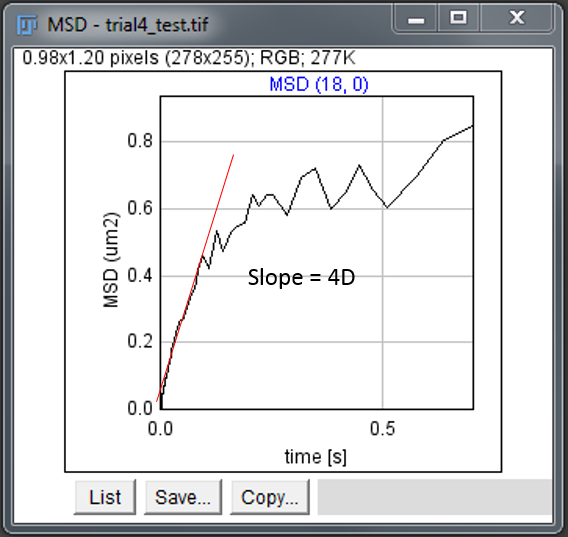{width="2.6666666666666665in"
height="2.521129702537183in"}

**Fig. 7.2**: MSD plot calculated from a correlation function of a DOPC
bilayer.

# Thresholds for fit results

This functionality can be used to filter out outliers in the parameter
maps. Parameter maps contain the fitted parameters multiplied by a mask
consisting of values either 1.0 (valid pixel) or NaN (rejected pixel)
and displayed for each channel (cross-correlation, green, red) in a
slice called "valid pixels". By multiplying the outliers in parameter
maps by NaN, they do not contribute to the respective histograms and
other statistics (mean, standard deviation, etc.). Nevertheless, the
original parameter values are kept and saved in the output files and can
be at any time displayed and included in the statistics by resetting the
thresholds. The thresholds are defined in "Threshold settings" (Fig.8.1)
panel which is opened by the button "Threshold" in the main panel. There
are two ways of applying the thresholds:

a)  First performing the correlation and fitting and then opening
    "Threshold settings" panel, defining the thresholds therein and
    applying them on the active parameter map.

b)  First defining the thresholds in "Threshold settings" panel and then
    performing the correlation and fitting while "Threshold settings"
    panel is open. The thresholds are applied on all parameter maps
    created or updated while "Threshold settings" panel is open. Note
    that in this way thresholds can be applied during batch processing.

The column on the left contains the individual fitting parameters and
Chi^2^, for which thresholds can be defined. The next column contains
radio buttons for selecting on which parameters thresholds will be
applied. The following columns contain the settings of the minimum and
maximum threshold for each parameter in the auto- (green and red) and
cross-correlation channels, respectively. Note that the text fields are
editable only for those parameters selected for thresholding by the
respective radio buttons; text fields for the cross-correlation channel
are active only when DC-FCCS fit model is selected. When opening the
"Thresholds settings" panel, the text fields are pre-filled with values
which are either:

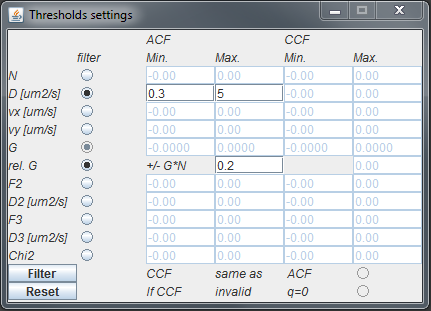{width="4.490209973753281in"
height="3.240034995625547in"}

**Fig. 8.1:** Threshold Window

a)  The maximum and minimum values for the respective parameter in the
    current parameter map (or 0.0 if no parameter map exists). This is
    always the case when opening "Thresholds settings" for the first
    time after starting the plugin.

b)  The last used threshold settings. When the users set their own
    threshold settings and apply them on a parameter map, the settings
    (including the minimum and maximum thresholds and all the radio
    button settings) are remembered even after the "Thresholds settings"
    panel has been closed and are recalled when the panel is opened
    again. The settings are remembered until the plugin is closed or
    until they are reset by the user. Note that if the user changes any
    settings and then closes the "Thresholds settings" panel without
    applying the new settings on any parameter map, the settings are not
    remembered after closing the panel. Since the settings are different
    in the FCS and DC-FCCS modes, any threshold settings are reset by
    switching between the modes.

Note that the thresholds for the asymptotic correlation *G* can be set
in two different ways: either in absolute values (such as is the case
with all other parameters) or as a fraction of the correlation function
amplitude (relative *G* = *G N*). Note that the radio button for
selecting the relative threshold for *G* is active only after the radio
button for *G* has been selected.

Below the parameter names are two buttons: "Filter" and "Reset".
Pressing "Filter" applies the current threshold settings on the active
parameter map. "Reset" resets all the settings to their default values
and also resets the "valid pixels" to 1.0 for all pixels and updates the
parameter map accordingly.

Bellow the thresholds settings for the cross-correlation channel there
are two additional radio buttons active only in DC-FCCS mode. The one
labelled as "*CCF same as ACF*" sets the thresholds for
cross-correlation channel to be equal to those for autocorrelation
channels. The text fields for the minimum and maximum threshold for CCF
then cease to be editable and any values in them are disregarded. The
other radio button is labelled as "*If CCF invalid q=0*". When selected,
the values of cross-correlation amount *q* are set to 0.0 in those
pixels for which the ACF fits passed the thresholds (the "valid pixels"
are 1.0 for both ACF channels) but the CCF did not ("valid pixels" are
NaN). This is important when fitting data exhibiting no
cross-correlation. In that case the CCFs (which contain almost solely
noise) are prone to erroneous fits giving parameters which fail to pass
the thresholds. Rejecting such pixels from the analysis is likely to
cause a bias in *q* towards larger values (CCFs with higher amplitudes
are more likely to be fitted correctly.

If individual data points are to be removed, you can double click any
point in the parameter maps. That data will then be set to NaN and will
not be used in statistics and evaluations.

# Number and Brightness analysis (N&B)

N&B analysis can be a powerful tool but has its problems in EMCCD based
measurements. For a thorough discussion, please see the article by Unruh
and Gratton (16). We implement here two possibilities to calculate the
N&B analysis. When pressing *N&B* a new panel will open as shown in Fig.
9.1. Note that in any case a background file has to be loaded over the
"Bgr NUM" button in the panel before this analysis works. The background
should be taken under the same conditions as the experiments, including
the size and area of the ROI. In this mode the button will change from
"Bgr NUM" to "Bgr FILE" and will calculate for each pixel correction
factors for mean and variance.

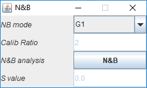

**Fig. 9.1**: N&B panel

**NB mode:** There are two modes. The first mode is the so-called G1
analysis and is similar to the estimation of the amplitude of a
correlation function of the first point at a non-zero lag time. The zero
lag time contains shot noise and is therefore not used in correlation
analysis. Essentially the G1 analysis is the estimation of the amplitude
over the second point of the autocorrelation function. It is achieved by
calculating the correlation for next-neighbour frames. This scheme works
if the acquisition time per frame is much shorter than the average time
a particle needs to diffuse through the observation volume of a pixel.
We have tested this mode and it provides the same brightness values as
the confocal case.

Pressing the "*N&B*" button will calculate the N and the B values for
each pixel according to the following equations (equations 1 in (16)):

$$N = \frac{\left( \left\langle I \right\rangle - offset \right)^{2}}{\sigma^{2} - \sigma_{0}^{2}}$$

$$B = \frac{\sigma^{2} - \sigma_{0}^{2}}{\left\langle I \right\rangle - offset}$$

Where $\left\langle I \right\rangle$ is the mean intensity in a pixel,
$offset$ is the offset of the camera, $\sigma^{2}$ is the variance of
the intensity of the pixel, and $\sigma_{0}^{2}$ is the variance of the
camera. $$ is essentially the mean background counts which is calculated
pixel-wise from the dark images.

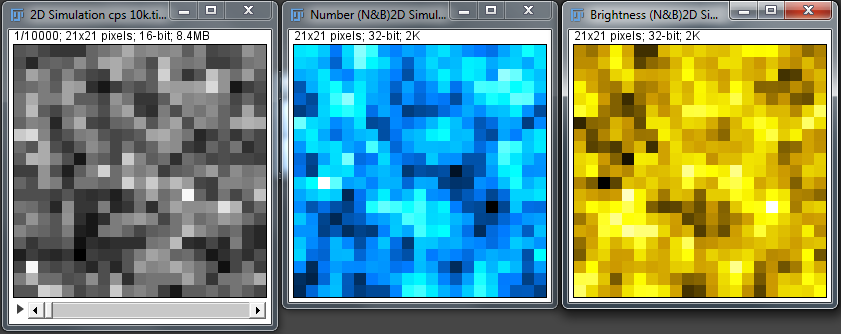{width="6.268055555555556in"
height="2.488888888888889in"}

**Fig. 9.2**: Examples of an image and the corresponding Number and
Brightness images. If "*CamCor*" is on, then another two images with *n*
and *ε'* (see text) will be displayed.

While these expressions provide an idea of the brightness of molecules
they do not give correct number and brightness values. Unruh and Gratton
have shown that a value *ε'*, which is proportional to the molecular
brightness *ε*, can be calculated if the parameter *S* is known. In that
case

$$\varepsilon^{'} = \frac{B}{S} - 1$$

$$n\varepsilon^{'} = \frac{\left\langle I \right\rangle - offset}{S}$$

If *S* is unknown, the camera can be calibrated if one has two files
with probes that have a known factor brightness ratio. In this case the
user can use "*calibrate*" which is in the drop-down-menu of the *NB
mode*. The user will then be asked for two files, where the first one is
assumed to be the one with the smaller brightness. Note that for this
calibration to work the two calibration files and later the actual image
to be treated have to be recorded with the exact same parameters and
illumination intensities. With the two calibration files, with a
calibration ratio *r*, one has then

$$B_{1} = \left( \varepsilon^{'} + 1 \right)S$$

$$B_{2} = \left( r\varepsilon^{'} + 1 \right)S$$

$${rB}_{1} - B_{2} = r\left( \varepsilon^{'} + 1 \right)S - \left( r\varepsilon^{'} + 1 \right)S = \left( r\varepsilon^{'} + r - {r\varepsilon}^{'} - 1 \right)S = (r - 1)S$$

$$S = {(rB}_{1} - B_{2})/(r - 1)$$

This way *S* is determined and will be provided in the text field. Then
one can press N&B to process the actual file.

*Note: The calibration mode have been tested two* *different monomeric
and dimeric construct of plasma membrane targeting (PMT) sequence (25)*
*e.g., PMT-mApple and PMT-mApple~2~.*

# Data table

The data can be visualized in a data Table by pressing the Table
"Create/Update" button. The data table is not automatically updated. The
table can be updated by pressing again the "Create/Update" button.

{width="2.8439337270341207in"
height="4.134353674540683in"}

**Fig. 10.1**: Data table. The first tab contains the panel parameters.
The other tabs contain the numerical values of calculations and fits.
The data in this table is the same that is saved in the .*xlsx* files.

# Saving and loading data

All data is saved in .*xlsx* files. This provides a spreadsheet format
which can be read by many other programs and facilitates the transfer of
the data to different programs.

***Note:** In general the plugins are [NOT backwards
compatible]{.underline} to earlier versions and experiments.*

When pressing the button "Save" a dialog will open asking the user which
data to save:

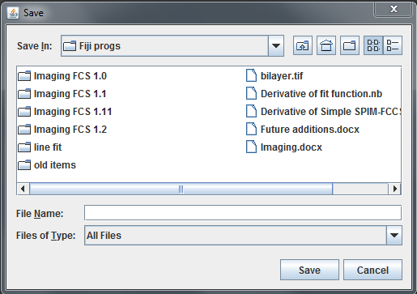{width="3.25in"
height="2.29077646544182in"}

***Note:** To open an experiment the [image for that experiment has to
be already loaded]{.underline}, otherwise the program will not recreate
the experiment!*

**Fig. 11.1**: File selection window.

There is a limit to the number of columns in an Excel file, which is
currently up to 16,384 columns in xlsx format. After discounting a
column used for row categories, we can save fitting results of up at
most 16,387 pixels at the moment. On a related note, the memory
consumption increases as the number of pixels increases and furthermore
it takes a longer time to process. A log prompt is shown when saving is
completed. This issue of saving large data file will be addressed in the
future when final version of SXSSF functionality in POI library is
available.

To access the dataset that has been processed earlier, including
threshold values, the user should click the "Read" button to search for
and select the *.xlsx* file that was saved beforehand. Upon selection,
ImFCS will promptly import the corresponding TIFF stacks as well as the
analysis values associated.

For an efficient data analysis workflow, such as creating *.xlsx* files
for each of image stacks, please refer to the following section on
executing these task in batch mode.

# Batch Mode

In batch mode, a dialogue window will be opened (Fig. 12.1) which allows
the user to select which calculations are to be performed. In addition,
a "suffix" text field allows the user to specify a suffix that will be
added to the image file name to create the new output file name for the
.*xlsx* file. If no suffix is specified the plugin adds the date and
time to the image file name to create a unique filename for saving.

For instance if an image file is called "bilayer.tif" and you specified
the suffix "-evaluated", then the output filename will be
"bilayer-evaluated.xlsx". If you did not specify a suffix and assuming
the program was run on May 11, 2015 at 10:30:12 (h:m:s), the output file
will be named "bilayer2015_05_11-10_32_12.xlsx".

After this selection an Open Dialog Window will be displayed (Fig.
12.2), which allows the user to select multiple files to be treated in
the batch mode. Note that at the moment only files can be selected, no
directories.

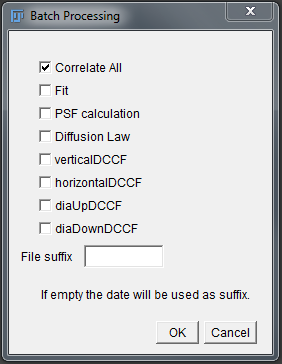{width="2.24670384951881in"
height="2.9in"}

**Fig. 12.1**: Batch processing dialog.

The resulting .*xlsx* files are saved in the same directory as the image
files.

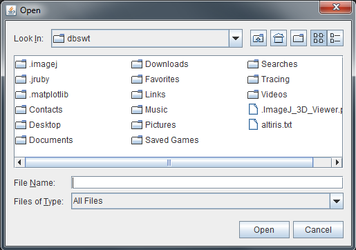{width="3.532919947506562in"
height="2.4833333333333334in"}

**Fig. 12.2**: The Open Dialog Window for Batch processing.

***Note**[:]{.underline} For the FCS diffusion law the batch mode will
use the current settings of the plugin. So if "All" has been chosen, the
diffusion law will be calculated for the whole image. If "ROI" has been
chosen, then the diffusion law will be calculated for 7x7 ROIs for the
whole picture.*

# Direct Camera Readout

**13.1 General Description**

ImFCS-Direct Camera Readout is an image acquisition software that does
real-time visualization of correlation functions without the need for
specialized hardware as all incoming pixels are streamed to RAM and
processed in a CPU/GPU. We have tested the tool so far on Andor iXon
DU860, DU888, DU897, Sona 11, Hamamatsu Orca Flash 4.0, Photometrics
Evolve 512 and Prime 95B. To activate, press the "*LiveReadout*" button
located on the first column of ImFCS main panel in Fig. 1.1.

{width="2.2612970253718285in"
height="2.0225404636920383in"}

**Fig. 13.1**: Direct Camera Readout main panel. This shows the example
of an Andor DU860 with full frame 128x128 pixels to be recorded.

A selector window will appear if multiple camera models are detected.
Otherwise, the Direct Camera Readout main panel (Fig. 13.1) will appear
on the screen. The interface has been designed to be similar, despite
the camera model connected. Some variations to accommodate camera
settings can be found under the Settings panel.

(1) Click on Settings toggle button to show/hide Setting window (Fig.
    13.2)

{width="2.639643482064742in"
height="2.5141819772528433in"}

**Fig. 13.2**: Settings panel containing control for FCS evaluation,
options for data visualization, and camera settings.

(a) Enable or disable polynomial **bleach correction** on intensity
    trace or spatial binned intensity trace depending on whether pixel
    binning is selected.

(b) **Correlator P**: The number of correlation channels for the first
    group of bin times.

(c) **Correlator Q**: The number of groups of bin times (including the
    first). The bin time within a group is constant but will be twice as
    large as the bin time of the preceding group.

(d) Enable **GPU** to speed up bleach correction and CF calculation. We
    recommend sticking with CPU for analysing small regions (\< 64
    $\times$ 64 pixels) as GPU outperforms CPU only when handling large
    amount of data, due to the overhead of loading data onto and off the
    GPU.

(e) **EM gain** can be varied depending on camera model.

(f) **Temperature** to which detector can be cooled.

(g) Speed of **cooling fan** can be controlled depending on the system.

(h) **Mechanical shutter** can be used to take a reference or background
    on selected cameras.

(i) A dialog box with multiple checklists for live plotting ACF and
    intensity trace within user defined ROI. In addition, an option to
    average CF and/or overlay ${ACF}_{green}$, ${ACF}_{red}$, and $CCF$
    are included (Fig. 13.3)

> {width="3.648488626421697in"
> height="2.2058278652668415in"}

**Fig. 13.3**: The Options dialog box (*left*) to visualize FCS data
with default values.

> ***Note***: Camera settings window (*e*) -- (*h*) varies depending on
> camera model.

(2) ROI toggle button reveal/hide ROI panel and selector window (Fig.
    13.4)

{width="4.735495406824147in"
height="2.773827646544182in"}

**Fig. 13.4**: ROI panel to selecting region of camera chip for
recording.

ROI selection can be made in three ways:

-   Annotating ROI selector window (*a*) via Fiji rectangular selection
    tools

-   Moving the selected region highlighted in green around the screen

-   Keying specific values under ROI panel

> Full button (*b*) ensure full-frame is selected. Centralized ROI can
> be set by keying value under width and height text box. Customized
> coordinates can be activated with a radio button (*c*). Combo box
> (*d*) starts in-camera pixel binning for better SNR at the expense of
> worse spatial resolution. Crop mode (*e*) reduces the height of CCD by
> excluding some rows to achieve higher frame rates.

**13.2 Main DCR panel**

The application currently supports five modes (Fig. 13.5): *Calibration
mode*, *Acquisition mode,* *Live video mode*, *ICCS mode*, and *Single
capture mode*. The modes can be run as follows:

{width="1.9483442694663167in"
height="2.0896741032370953in"}

**Fig. 13.5**: Drop down menu showing 5 different mode

> ***Step 1***: Select your preferred mode from the drop-down menus
>
> ***Step 2***: Make changes to "*ROI*" via toggle button
>
> ***Step 3***: Set camera "*Exposure Time*"
>
> ***Step 4***: Set "*Total Frame*" (*acquisition mode only*)
>
> ***Step 5***: Press "*Start*" button
>
> ***Step 6***: Press "*Stop*" button to abort
>
> ***Step 7***: Press "*Save*" button (*acquisition mode only)*
>
> ***Note***: *Pixel Binning*, *CCF distance*, Settings \>\> *Bleach
> correction*, Settings \>\> *Correlator P*, Settings \>\> *Correlator
> Q*, Settings \>\> *Options* can be altered while camera is recording.

**13.3 Calibration mode**

{width="5.291692913385827in"
height="2.8985279965004374in"}

**Fig. 13.6**: FCS data visualization offered within calibration mode.

Calibration mode runs under an infinite loop until the stop button is
pressed. The user is presented with a Live Video window at 25 fps to
make ROI selections for analysis. Non-cumulative display of CF (Fig.
13.6 A), average non-bleach corrected intensity trace (Fig, 13.6 B), and
plot of G(0)/Intensity/Diffusion (Fig. 13.6 C-E) updates at every cycle
defined by *Exposure Time* $\times$ *Plot Interval* (Fig. 13.6 F).

A calibration panel (Fig. 13.6 F) will appear for the user to set plot
interval (number of frames in which CF within ROI is calculated) and
options to display plot of G(0)/Intensity/Diffusion from the preceding
instance of CF.

Usage of calibration mode includes fine focus tuning (TIRFM and SPIM),
critical angle calibration (TIRFM), Dual-View alignment for simultaneous
dual-colour experiment recorded on a single camera chip, sample
screening, and long term sample observation.

[Focus alignment:]{.underline}

***Step 1***: Make selection of ROI on the screen

***Step 2***: Set CCF distance to (0 x 0) for autocorrelation

***Step 3***: Set Pixel binning value to (1 x 1)

***Step 4***: Set "*Plot Interval*" (500 -- 1000 frames is a good
start), the number of frames where CF is calculated from selected ROI

***Step 5***: Adjust the position of objective (manually or
electronically depending on the system you are using)

***Step 6***: Monitor correlation value (A and C)

***Step 7***: Repeat step 4 and step 5 till maximum correlation
achieved.

Note: If no correlation observed, proceed to angle calibration and make
sure TIR is achieved. If persist, increment "*Plot Interval*", *Exposure
Time*, size of ROI, or *Pixel binning* to improve SNR. Proceed to
increase laser power if all attempt fails.

[Critical angle alignment:]{.underline}

***Step 1***: Visually locate the focal plane of the sample

***Step 2***: Make selection of ROI on the screen

***Step 3***: Set CCF distance to (0 x 0) for autocorrelation

***Step 4***: Set Pixel binning value to (1 x 1)

***Step 5***: Set "*Plot Interval*" (500 -- 1000 frames is a good
start), the number of frames where CF is calculated from selected ROI

***Step 6***: Make changes to incidence angle while maximising for
correlation amplitude (A and C)

***Step 7***: Optimize focussing by maximising correlation amplitude.
(Refer to focussing step described previously)

***Step 8***: Repeat Step 6 and Step 7 a few times

***Step 9***: Note down position corresponding to maximum correlation
function and calibrate the system against the critical angle.

[Dual-View alignment:]{.underline}

***Step 1***: Proceed to align for *Critical angle* and *Focussing*

***Step 2***: Set CCF distance (distance between red and green channel)
in a desired arrangement (in our case we set CCF x = 0, CCF y = 64 since
we are arranging the red channel south of green channel on a 128 x 128
sensor)

***Step 3***: Set Pixel binning value to (1 x 1)

***Step 4***: Make selection of ROI on the screen

***Step 5***: Traverse one channel with respect to another

***Step 6***: monitoring cross-correlation amplitude (A and C)

***Step 7***: Repeat step 5 and step 6 for maximum cross-correlation
amplitude

***Step 8***: The two channels are now spatially equivalent. Proceed to
experiment

The procedure for focus and angle alignment is presented in Fig. 13.7.
Critical angle calibration requires focal plane of the imaging system to
overlap that of 2D plane of interest (near cover slip for TIRFM) In
order to accurately determine the incidence angle and evanescent field
penetration depth, system need to be calibrated against critical angle
position. We recommend to proceed with Fig. 13.7 (*right*) till the
maximum amplitude of correlation functions is reached, Once TIR
illumination has be setted, fine focus tuning can be performed before
measurement.

{width="3.7199453193350833in"
height="3.9981342957130357in"}

**Fig. 13.7**: Recommended procedure for alignment.

**13.4 Acquisition mode**

Use this mode when data saving is required. As you select acquisition
mode you need to provide the total number of frames to be saved. The
user can, however stop the acquisition at any time using "*Stop*". The
so far acquired data can be saved, pressing "*Save*", which triggers a
dialog box to save the imagestacks *(.tif)* and metadata *(.csv).* Note
the maximum number of frames are limited by the number of pixels per
frame and the available RAM.

{width="3.5940496500437447in"
height="2.847844488188976in"}

**Fig. 13.8**: Acquisition mode with live development of correlation
functions.

To display correlation functions live, create an ROI in the "*Live*"
window (Fig. 13.8 A). The correlation functions and the corresponding
non-bleach corrected intensity trace are displayed (Fig. 13.8 B)

**13.5 Live video mode**

A basic functionality to let user start recording videos and display
frames on the screen at 25 fps. Note that refresh rate drops below 25
fps if exposure time is set above 40 ms.

**13.6 ICCS mode**

***Step 1***: Prepare a fiducial marker, e.g. immobilized fluorescence
beads on cover glass

***Step 2***: Find focal plane and adjust incidence angle \> critical
angle if you are using TIRFM

***Step 3***: Set CCF distance (distance between red and green channel)
in a desired arrangement (in our case we set CCF x = 0, CCF y = 64 since
we are arranging the red channel south of green channel on a 128 x 128
sensor)

***Step 4***: Set the spatial shift (x, y) for cross-correlation matrix
(CCM)

{width="2.961965223097113in"
height="1.5867672790901137in"}

**Fig. 13.9**: ICCS control panel

***Step 5***: Make selection on the screen (Fig. 13.10)

{width="1.8338374890638671in"
height="1.9738254593175852in"}

**Fig. 13.10**: 25 fps live video window where user can make selection
on the screen

***Step 6***: Center the maxima of CCM between two channels (Fig. 13.11)
as you correct for linear drift by manually altering the projection from
one of the channel. The vector position of the maximum indicate the
linear drift

{width="4.458320209973754in"
height="1.1632327209098863in"}

**Fig. 13.11**: CCM between two region. Red pixel indicate vector
position of maximum correlation value.

***Step 7***: For sub-pixel precise alignment, fit the cross-correlation
matrix with 2D Gaussian fitting model by pressing "*Fit on*" and monitor
the vertical and horizontal drift curves while aligning. An aligned
system should gives you a near 0 drift value

{width="4.315705380577428in"
height="2.6092169728783903in"}

**Fig. 13.12**: Slight misalign indistinguishable from CCM. Toggle "Fit
on" to localise for centroid.

***Step 8***: Prepare sample and proceed for measurement

**13.7 Single capture mode**

Capture a single frame and display images on the screen. Use this mode
to update the ROI selector window.

# Exiting the plugin

Press the "Exit" button and the plugin will be terminated and all
windows and data will be removed.

# Checking Progress

Progress for all calculations is shown in the ImageJ status bar. It is
given as a progress bar and a short message what is being done (here:
"Correlating all pixels").

**Fig. 14.1:** Progress is indicated by a progress bar including a short
message about what is being done.

> {width="4.173333333333333in"
> height="0.7490605861767279in"}

# Theoretical ACFs and Simulations

The plugin allows to plot theoretical FCS functions or to simulate a 2D
diffusive system (a 3D version is planned for later).

By pressing the "Test" button in the Fit panel (see Fig. 3.1) the
theoretical ACF with the parameters form the fit panel will be plotted
in the "Correlation Function Display" window. This can be useful to
obtain estimates for initial parameters or in general to get a feeling
for the changes of ACF functions with parameters.

The button "Simulation" in the control panel will bring up a dialog with
adjustable parameters for a simulation (for details see Annex 4). A
simulation for 100,000 frames with 20x20 pixels and 400 simulated
particles takes about 40 seconds to run. The simulator creates an Image
which is automatically set as the active window for the plugin. All
operations of the plugin can be applied to this image.

# Known Issues

1.  In Micromanager use ImageJ version 1.47v or later (which come with
    Micromanager version 1.4.16 and later). In earlier Micromanager
    versions 1.4.14 and 1.4.15, which are bundled with earlier versions
    of ImageJ, the program can be slow or possibly does not support the
    output of plots.

2.  In the ImageJ2 update from June 2014 (ImageJ 2.0.0-fc-SNAPSHOT)
    switch SCIFIO off for loading images. This does not work properly
    with the plugin. You can do that under the menu item
    Edit/Options/ImageJ2 and then make sure that the option "Use SCIFIO
    when opening files" is not ticked.

3.  If "Fit" is switched on but the data cannot be properly fit, it can
    happen that ImFCS Fitting window display wrong/NaN initial fit
    parameters. Users are required to press "Default" or manually reset
    initial parameters for fitting. Alternatively, press "Fix" to keep
    initialization parameter at a desired constant values.

4.  If the plugin/.jar file creates error messages when started, check
    that you run ImageJ 1.50a or higher.

5.  

6.  Direct camera readout -- Upon update to ij.-1.53q, creation of image
    e.g, ROI panel, ICCS mode slows down. Temporary solution is to
    replace with ij.-1.53f.jar in the Fiji/jars folder.

7.  Imaging FCS analysis software -- GPU fails to correlate when binning
    is not 1x1 when user select ROI mode.

8.  

# Changes to ImagingFCS

a.  **Changes from 1.612 to 1.613 (version 1.61 patch no 3)**

```{=html}
<!-- -->
```
1.  DCR: Added support for Photometrics Kinetix sCMOS ("TMP-Kinetix"),
    compiled using the PVCam SDK version 3.10.1.1.

2.  DCR: Implemented the saving of time-tagged JSON file formats to mark
    the list of frame numbers during which adjustments to the microscope
    were made.

3.  Resolved the issue that prevented the plotting of all DC-FCCS curves
    when threshold filtering was disabled.

4.  Introduced a feature to toggle the display between only
    cross-correlation functions ("FCCS Disp off") and all auto- and
    cross-correlation functions ("FCCS Disp on") when a region of
    interest (ROI) is selected on the parameter map.

5.  Enabled the display of correlation functions (CFs) with valid pixels
    when the Threshold is active. All CFs are now displayed when the
    Threshold is inactive.

6.  Modified to display CFs only for pixels with common valid data
    across all channels (ACF1, ACF2, CCF) when both "Threshold" and
    "FCCS Disp" are active. Display only valid CCF pixels when "FCCS
    Disp" is inactive.

7.  Corrected the bug to ensure only average CFs are plotted within the
    bound of the ROI-drawn parameter map. Average all CFs within the ROI
    if "Threshold" is inactive, and average only valid CFs when
    "Threshold" is active. This fixes the previous issue where the
    Average button incorrectly averaged all calculated CFs.

8.  Changed ImFCCS not to recalculate fits by default when loading a
    saved file unless a new calculation is triggered.

9.  Introduced a new background subtraction scheme with options for
    minimum counts per image stack, per pixel per image stack, and frame
    by frame, applicable before or after bleach correction, supporting
    both CPU and GPU modes in single-color mode and CPU only for DC-FCCS
    mode.

10. Added functionality to read and save files. Plugins now load saved
    Excel files by locating the original TIFF stacks.

11. Improved performance by removing the slow feature in the average
    intensity trace calculation for all pixels, with the "All pixel"
    execution now 44 seconds faster for 128 $\times$ 128 $\times$ 50,000
    frames. Individual pixel data retrieval, both non-bleach corrected
    (via mouse click on TIRF map) and bleach corrected (via mouse click
    on parameter map), remains available.

12. DCR: Created an additional GUI feature to display only odd frames,
    even frames, or all frames, with the added capability to average or
    bin live video images.

13. DCR: Added an option to toggle the dynamic range for live images on
    or off.

14. DCR: Fixed a bug to prevent accidental changes to the ROI selection
    area within the "ROI Selector Window" while the camera is active.

15. 

16. DCR: Capture a single image and update image onto "ROI selector
    Window" when user toggle ROI panel.

> $$

17. DCR: Implemented a safeguard to prevent file overwriting when the
    filename already exists.

18. Enabled the option to save Parameter maps while processing in batch
    mode, with an additional option to stop between images.

19. DCR: Added a feature to arbitrarily set the start frame for
    correlation during cumulative mode.

20. DCR: Added a feature to toggle between cumulative and non-cumulative
    display of correlation functions.

21. DCR: Close all open graphs before starting a new acquisition to
    de-clutter the interface.

22. DCR: prevent the following window to be minimized and closed: ROI,
    Settings, Calibration, ICCS, ROI Selector Window, Live Image window.

23. DCR: Enabled the saving of large TIFF stacks (e.g., \> 30 GB) as a
    single file, provided sufficient RAM.

24. Resolved a bug where GPU mode failed to threshold pixels based on
    intensity.

25. Fixed an issue that caused unnecessary re-calculation of fitted 3D
    ACFs when a pixel within an ROI or selected on a parameter map.

26. DCR: Added an option to choose whether or not to display the saved
    image in Fiji.

27. Corrected the reading of saved data with "Overlap On" to ensure
    accuracy.

28. Fixed a bug to enable an option to exclude the fitting of the
    initial points of the correlation function while running in GPU
    mode.

29. Added an option to enable or disable GPU mode during
    post-processing.

30. Fix bug to correctly fit the specified portion of average
    correlation function when Average button is pressed.

31. Fix bug to correctly background subtract ACF (red) when running
    DC-FCCS mode.

    a.  **Changes from 1.61 to 1.612 (version 1.61 patch no 2)**

```{=html}
<!-- -->
```
1.  Drop metadata information on internal line speed and line interval
    for Hamamatsu Orca Flash 4.0 (not supported).

2.  Fixes bug where ACF and fits are displayed even though pixels are
    invalid/outside threshold range.

3.  Compiled with ij.-1.53f

4.  Increase maximum byte per image stack to 3.7GB. File larger than
    3.7GB will be save as 2 or more separate stacks.

    a.  **Changes from 1.60 to 1.61**

```{=html}
<!-- -->
```
1.  Added support for Hamamatsu ORCA-Quest C15550-20UP.

2.  Fixes file saving issue (program stalls-out when saving large amount
    of dataset \> 4GB).

3.  Fix bug on ROI selection with Hamamatsu camera. Now automatically
    select to nearest valid ROI.

4.  Enhance file saving routine to remember the last save location.

5.  

6.  

7.  Prompt user to enter experimental parameters on starting camera.

    a.  **Changes from 1.52 to 1.60**

```{=html}
<!-- -->
```
1.  Direct Camera Readout (v 1.1) has been added as a data acquisition
    tools with real-time cumulative and non-cumulative spatio-temporal
    correlation visualization. It supports Andor DU860_BV, DU888_BV,
    DU897_BV, SONA-4BV11, Hamamatsu Orca Flash 4.0 C11440-22CU,
    C11440-22C, C13440-20CU, C13440-20C, Photometrics EVOLVE- 512, Prime
    95B GS144BSI.

2.  Added '*Pvideo*': a routine calculating parameter video maps from an
    image stack (performs segment wise bleach correction).

3.  Added bleach correction parameter: number of intensity points to be
    averaged before bleach correction is performed.

4.  Introduced 'Experimental Settings' Panel to store experimental
    specific settings and declutter main panel.

5.  Write and read a configuration file in user home directory storing
    ImFCS settings.

6.  Saved experiment file no longer backwards compatible (version 1.52
    and before).

7.  Fit panel: added default button to set all fit parameters to their
    default value

8.  Cursors can now be used to move through the image and correlations
    and fits are automatically done Fit panel: added default button to
    set all fit parameters to their default value

    a.  **Changes from 1.51 to 1.52**

```{=html}
<!-- -->
```
1.  ACF, CCF, N&B, polynomial bleach correction, diffusion law and PSF
    calibration can be computed on NVIDIA GPU.

2.  Improve stability of Save and Read functions.

3.  3D free diffusion simulation has been modified to correct for the
    rounding off errors in the number of photons emitted from particles
    across the z plane. The extension in z plane has also been increased
    to have a more uniform distribution of particles for a free
    diffusion simulation.

    a.  **Changes from 1.50 to 1.51**

```{=html}
<!-- -->
```
1.  A batch simulation mode has been introduced (with limited
    functionality which allows simulating a batch of data with a range
    of D1, D2, and F2).

2.  Rectangular binning is now supported and the fit models have been
    updated accordingly. At this point in time, square binning is much
    faster when fits are performed.

    a.  **Changes from 1.49 to 1.50**

```{=html}
<!-- -->
```
1.  The saving and loading of experiments were improved. Unfortunately,
    that also means that there is no backward compatibility for the
    loading of saved experiments with older versions.

2.  N&B analysis has been improved.

3.  The PSF calibration was improved and one can select now the binning
    to be used.

4.  An exponential term is now included in the fitting function to
    account for triplets or photophysics.

5.  We have included an ImageJ update site for "ImagingFCS" to
    facilitate installations.

6.  A mistake in the simulations was corrected. If the fractions for the
    first and second diffusive particles did not add up to N, the total
    number of simulated particles, then it could happen that one
    particle with diffusion coefficient 3 was simulated along. This is a
    rounding error as only integer numbers are allowed. This is
    corrected now and if the fraction for the third particle is set to
    0, then no third particle will be simulated.

    a.  **Changes from 1.48 to 1.49**

```{=html}
<!-- -->
```
1.  Users can now calculate an average correlation function over all
    valid pixels in an image.

2.  The diffusion law can now be calculated for sub-regions of an image.
    At the moment this is implemented for 7x7 pixel areas with binning
    from 1 to 5 using overlap mode.

3.  [Note that now older experiments saved with versions 1.48 and
    earlier cannot be loaded with this plugin anymore]{.underline}

    a.  **Changes from 1.47 to 1.48**

```{=html}
<!-- -->
```
1.  In DC-FCCS we calculate now for each pixel the cross-correlation
    amount (*q*).

2.  A threshold window was included which allows to filter results
    within certain parameter ranges. This can be useful to exclude
    outliers.

3.  The parameter maps contain additional slices to depict the q value
    (DC-FCCS) and the validity of pixels for applied thresholds.

    a.  **Changes from 1.46 to 1.47**

```{=html}
<!-- -->
```
1.  The values in the intensity filter function to select pixels for
    data treatment was incorrectly calculated for binning \> 1. This has
    been corrected.

2.  The program allows now correcting the data with a background image.
    This removes patterned noise, which can be important at low EM
    gains.

3.  A number and brightness analysis routine is now included in the
    program based on the article by Unruh et al. (16).

    a.  **Changes from 1.45 to 1.46**

```{=html}
<!-- -->
```
1.  The simulations were extended and can now correctly perform domain
    and meshwork simulations in 2D (but not yet domains and meshworks
    simultaneously).

2.  Diffusion law fits have now their own panel where the diffusion law
    calculation and the fitting can be controlled.

3.  An option panel was added which allows to choose which windows the
    user wants to see. The user can now also see the covariance matrix
    for the ACF and the blocking functions. In addition, some windows
    can be switched off if they are not of interest to avoid cluttering
    of the screen.

    a.  **Changes from 1.43 to 1.45**

```{=html}
<!-- -->
```
1.  The ACF fits were made considerably faster (see typical performance
    values as given on the website).

2.  A bug was corrected which lead to repeated pop-up windows if
    parameters were set out of realistic bounds for the fits. If
    parameters are unrealistic there is now a single message and the
    fits are all terminated.

3.  The simulations were improved to contain more options and a new
    panel.

4.  A bug in the display of dCCF functions when using pixel binning was
    corrected.

    a.  **Changes from 1.42 to 1.43**

```{=html}
<!-- -->
```
1.  The simulator was upgraded and allows not 2D and 3D simulations.

2.  The parameter maps are now set overall to "NaN" so that the
    statistics of the histograms takes only account of the actually
    fitted values. Therefore, the average values in the title of the
    parameter windows have been removed.

3.  Clicking a pixel in the parameter window now updates all windows
    including the intensity and residual windows.

4.  One can now remove single fitting and correlation results by double
    clicking on a pixel in the parameter maps.

5.  "Singular Matrix Error" messages are not anymore displayed. The fit
    is unsuccessful and the values in the parameter windows are set to
    NaN (not a number).

6.  The linear fit for the diffusion law is now weighted correctly with
    the variance (before it was weighted with the standard deviation).

    a.  **Changes from 1.41 to 1.42**

```{=html}
<!-- -->
```
1.  An FCS simulator was included. However, at the moment it is
    restricted to 2D diffusion.

    a.  **Changes from 1.4 to 1.41**

```{=html}
<!-- -->
```
1.  Bug fixes regarding the calculation of some of the areas for ROIs
    and the creation for irregular ROIs for the spatial
    cross-correlation.

2.  MSD was originally calculated only for 2D samples, i.e. for
    ITIR-FCS. MSD is now also calculated for SPIM.

3.  Documentation was corrected, as in the SPIM function a factor 4 was
    missing in the last term.

    a.  **Changes from 1.3 to 1.4**

```{=html}
<!-- -->
```
1.  The program now saves all data in the .*xlsx* spreadsheet format and
    reconstitutes experiments from these files. [Note that now older
    experiments saved with versions 1.3 and earlier cannot be loaded
    with this plugin anymore.]{.underline}

2.  The mean square displacement (MSD) can now be directly calculated
    from the correlation function (2D diffusion only at the moment).

3.  A Data table file can be created to visualize the numerical values
    of the results.

4.  Multiple bugs relating to the depiction of the FCCS functions were
    corrected.

5.  "Overlap" mode can now also be used for the calculation of diffusion
    laws.

6.  Additional bleach correction modes were added.

7.  "NullPointerExceptions" that crept up with one of the recent Fiji
    updates were corrected.

    a.  **Changes from 1.29 to 1.3**

```{=html}
<!-- -->
```
1.  The program allows now also to calculate correlations and fits in a
    region of interest (ROI). Just select any region of interest and
    click "ROI" in the panel to obtain the correlations.

2.  The FCS fit model was updated to have now up to 3 diffusing
    components. While this is of limited use as the Imaging FCS data (or
    any other FCS data for that matter) does typically not have
    sufficient S/N to resolve 3 components, it can be useful for
    comparison in Bayesian Model Selection. Note that the FCCS model
    contains still maximally 2 components.

3.  The FCS model has been corrected as there was an error in the
    calculations of the derivatives for the fraction of the second
    component. This however did not affect any one component fits done
    up to now.

4.  Fitting: Note that we do not support anymore non-weighted fits. We
    have introduced two new options in fitting, "GLS" and "Bayes". If
    both are off, fits are performed by weighted non-linear least
    squares fitting. If Generalized Least Squares (GLS) is on then fits
    take the covariance matrix into account and not only the variances.
    The fits however take much longer. So for initial evaluations we
    still recommend to use the normal weighted fits. If "Bayes" is on
    then multiple models (at the moment only 1 and 2 component models;
    in the future we will introduce options to select and include more
    models) are fit and the likelihood of each model is provided.
    "Bayes" works with non-linear least squares and also with GLS.

5.  In the Fit panel we have introduced a "Set" and "Free/Fixed" button.
    The set button sets the current fit parameters as fixed and all fits
    always start with these fit parameters. Each time the set button is
    pressed the fit parameters are set new to the current values. To
    undo that the "Free/Fixed" button can be clicked. If it is set to
    free, then each fit starts with the resulting fit parameters from
    the last fit. This is useful where the correlations functions have a
    trend to shift over the image so that the first and last pixel have
    very different values but there is a smooth transition for the
    pixels in between.

6.  All correlations and fitting is done now on a background thread in
    Java. This allows the user to continue working while the
    calculations are done.

7.  A progress bar is now indicated instead of the counting of
    calculations to show the progress.

    a.  **Changes from 1.26 to 1.29**

```{=html}
<!-- -->
```
1.  A bug was fixed in the sliding window bleach correction which caused
    the correlation to be always calculated for a sub-stack starting
    with slide 1 (irrespective of what value was entered in the field
    \"First frame\").

2.  A bug in DC-FCCS was fixed which was preventing fitting of the ACFs
    in the red channel, causing the program to abort calculating and
    fitting the correlation functions.

3.  Updating of window names was introduced for all output windows; when
    output windows are re-used for results of correlation of a newly
    loaded image, their names are updated to match the name of the
    current image.

4.  A bug was fixed in creating parameter maps in DC-FCCS; when x or y
    coordinate of the initial pixel of the green region was larger than
    0, the bug resulted in parameters for only a part of the selected
    region being displayed in the map, the rest of the pixels in the
    parameter map containing zeros.

5.  In DC-FCCS, parameter maps are shown for the cross-correlation as
    well as for the autocorrelations in both the green and the red
    channel in the following order: parameters for cross-correlation,
    parameters for green channel, parameters for red channel, Chi2 of
    CCF fit, Chi2 of green ACF fit and Chi2 of red ACF fit.

6.  The fit model for 2 diffusive components was corrected as in the
    normalization the denominator was not raised to the second power.
    This influenced if at all only amplitude, no diffusion coefficients.

7.  We introduced a new "Overlap" toggle button. This is important for
    binning. Previously only non-overlapping binned pixels were allowed.
    In this version the user can chose between overlapping and
    non-overlapping pixels.

8.  We introduced the blocking Transform (3) to calculate the standard
    deviation of the ACFs. The blocked standard deviation also takes
    account of the noise correlations and should lead to better fits.
    Whether blocking was successful (and thus the data collection was
    sufficient) is shown in an own panel in the parameter maps. It is
    also saved along with the Fitting parameters.

9.  The exponential bleach correction has been improved and now
    conserves the average and variance (17).

10. Fit parameters and fit functions can now be re-called by pressing on
    a pixel in the parameter maps.

# Acknowledgements

The original program was written by Thorsten Wohland. Radek Machan was
responsible for many bug fixes in the newer versions and work on the
DC-FCCS part. Jagadish Sankaran wrote the MSD calculation algorithm and
improved the data fitting part of the program. Mark Bathe and Syuan-Ming
Guo wrote the first GLS and Bayesian Model Selection algorithms in
Matlab (<http://fcs-bayes.org/>) and they helped Thorsten with the
coding of the algorithm in Java. Jagadish Sankaran and Tang Wai Hoh
wrote the CUDA code that enables computations on NVIDIA GPU. Daniel Aik
wrote the Direct Camera Readout program interfacing with several cameras
for real-time evaluation of FCS data. Many people in the lab checked the
program for bugs which improved the program considerably. Any feedback
or help in improving the program is welcome.

# Annex 1: Control Panel "ImFCS" Element {#annex-1-control-panel-imfcs-element .unnumbered}

{width="3.622405949256343in"
height="3.2887642169728784in"}

**Use**: Pressing the "Use" button will tell the program to use the
uppermost image window in ImageJ for the correlations. This image has to
be a 16 bit grey value stack, otherwise the program will provide an
error message. If unsure which window is on top, you can just click the
window you want to use before pressing the use button.

**Load**: This button will open a dialogue for loading an image file,
which is then used in ImFCS.

**Batch**: Allows to evaluate several files with the same options. First
the user will be asked which evaluations to perform. Then the user will
be asked to select one or multiple files. The files will then be
sequentially loaded and evaluated and the data will be saved in .*xlsx*
files (see section 8).

**First Frame**: This is the first frame at which the correlator will
start. This parameter is typically 1 but can be changed so that the
correlations will start from any frame you chose. This allows the user
to analyse correlations at any time within the image series. This might
be important if the camera has an unstable baseline at the beginning of
an image series, or if there are any other artefacts at the start of the
imaging series.

**Last Frame**: This is the last frame the correlator will use. This
parameter is set to the last frame of the loaded image. It can be
changed if only part of the stack is to be correlated.

**Frame Time**: The user has to provide the acquisition time per frame
which was used in the acquisition of the image stack. This will
influence the time axis and the fit results. ***Note**: Changing this
value at any time will lead to the reformatting of the parameter window
and the deletion of all fit results.*

**Binning**: This allows binning multiple pixels into a larger pixel.
Pressing this button will open a dialog where x- and y-binning values
can be specified. ***Note**: Changing this value at any time will lead
to the reformatting of the parameter window and the deletion of all fit
results.*

**CF X Distance and CF Y Distance**: If spatial cross-correlations are
to be calculated, this provides the distance in pixels (including
binning) between the pixels to be correlated. These pixels are indicated
in the image as a blue and red frame (correlations are calculated from
blue to red). ***Note**: Changing this value at any time will lead to
the reformatting of the parameter window and the deletion of all fit
results.*

**Correlator P**: The number of correlation channels for the first group
of bin times. The bin time is equal to the Frame time/acquisition time.
This can bet set to 16 or 32. All following bin times will have half the
number of channels, i.e. 8 or 16.

**Correlator Q**: This is the number of groups of bin times (including
the first). The bin time within a group is constant but it will be
always twice as large as the bin time of the preceding group.

Example: Using a Correlator P of 16 and a Correlator Q of 6 with a Frame
time of 1 ms results in the following time points for the correlation:

Group 1: 1, 2, 3, 4, 5, 6, 7, 8, 9, 10, 11, 12, 13, 14, 15, 16

Group 2: 18, 20, 22, 24, 26, 28, 30, 32

Group 3: 36, 40, 44, 48, 52, 56, 60, 64

Group 4: 72, 80 ...

Group 5: 144, 160, ...

Group 6: 288, 320 ... 512

ImFCS actually also calculates the 0 lagtime channel. It is an
indication of the shot noise, but actually it is not used in data
fitting.

**Fit Model**: There are two choices. First there is "FCS" which
provides a fit for autocorrelation functions and spatial
cross-correlation functions. The second option is "DC-FCCS" and provides
dual-colour fluorescence cross-correlation fits. It is assumed that for
DC-FCCS the image was split into two different wavelength ranges which
were then imaged onto one camera so that a part of the camera contains
the data for the shorter wavelength (green) and another part contains
the data for the longer wavelength (red). The distance between the
"green" and "red" pixels has to be provided in the "CF X distance" and
"CF Y distance fields".

**FCCS Display**: If this is switched on (can only be used if the
"DC-FCCS" fit model is chosen) then both ACFs and the CCF will be
depicted. Otherwise only the CCF will be shown.

**Pixel Size \[um\]**: Size of the actual pixel on the camera chip. This
is typically in the range between 5 -- 25 μm and can be obtained from
the camera datasheet.

**Overlap**: This is a toggle button to switch overlap on/off. This has
meaning only when binning is used. In the case of binning, one can chose
whether one wants to obtain only non-overlapping pixels, or whether one
wants to have overlapping pixels. The overlap mode can be practical in
spatial correlation or FCCS measurements.

**Magnification**: Magnification of the optical system. This is required
to calculate the pixel size in object space (=pixel size/magnification).

**NA**: numerical aperture of the microscope objective, used to
calculate the PSF.

**Em. Wavelength 1**: Wavelength of emission, λ~em~, for the fluorophore
used. This value is used to calculate the PSF.

**Em. Wavelength 2**: (DC-FCCS only) Wavelength of emission, λ~em~, for
the second fluorophore used in the case of DC-FCCS. This value is used
to calculate the PSF.

**lateral PSF (xy)**: This value, which we will call σ~0~, characterizes
the 1/e^2^ radius of the PSF in the lateral direction (along the light
sheet). Which is given by σ~0~ λ~em~/NA. A typical value is 0.8 (note
that in the past we also used the 1/e radius which is just half of the
1/e^2^ radius; so in that case the value would have been 0.4; we decided
to switch to the usage of the 1/e^2^ radius as this is the common figure
used in FCS).

**axial PSF (z)**: This value, which we will call σ~z~, characterizes
the 1/e^2^ radius of the PSF in the axial direction (across the light
sheet), which is given by σ~0~ λ~em~/NA. To obtain good values the light
sheet thickness needs to be measured. If a 2D correlation is desired,
the value can be set to a large number (the default is 1000000) in which
case the thickness plays no role in the correlation and essentially a 2D
fit is performed (e.g. for imaging total internal reflection FCS or
ITIR-FCS).

Assuming a Gaussian light sheet cross section in the z-direction, the
following relations hold between the 1/e^2^ radius (ω) and the full
width half maximum (FWHM):

ω = FWHM/2ln(2) = σ~0~ λ~em~/NA

σ~0~ = NA\*FWHM/(λ~em~ \* 2ln(2))

Here NA is the numerical aperture of the [detection]{.underline}
objective and λ~em~ is the emission wavelength of the fluorophore
observed.

Note that the observation volume is defined by the light sheet thickness
and the pinhole effect of the pixel. Similar to the pinhole in a
confocal system, the pixel will detect light from different planes
differently. The user should take account of this fact when providing
the axial PSF (REF).

**lateral PSF2 (xy)**: (DC-FCCS only) Same as above for the second, red
wavelength range for DC-FCCS.

**axial PSF2 (z)**: (DC-FCCS only) Same as above for the second, red
wavelength range for DC-FCCS.

**Bgr NUM (button)**: For this to work the user needs a "background"
file, which is a file recorded with the shutter closed at the exact same
location, with the exact same parameters and the same number of frames
as the actual data file. EMCCDs show often patterns even on images taken
with the shutter closed. This pattern can depend on the column, row or
pixel (18). Here, we decided to correct every pixel for its noise
individually. After this correction the Background (text field) and
Background2 (text field) are automatically set to 0. Overall this
correction is not crucial in FCS as the signal-to-noise ratio is
typically quite large and thus the patterned noise is negligible.
However, at very low intensities, in N&B analysis, one can sometimes see
that pattern and a correction is required.

**Background (text field)**: This value is automatically determined as
the smallest pixel value in the stack to avoid negative values. But it
can be changed manually. This will influence the amplitude and thus the
parameter N in the fits.

**Background2 (text field)**: (DC-FCCS only) This can be adjusted in
case the data for the red channel has a different background. The
default value is the same as Background. [If the two channels have
different backgrounds, then both, Background and Background 2 have to be
adjusted manually.]{.underline}

**Options:** Select which plots (ACF, SD, residuals, histograms etc.)
should be shown.

**N&B:** Number and Brightness analysis.

**Threshold:** This will open a window in which the user can filter the
fit results by parameter ranges. This allows the exclusion of outliers
from the data.

**Average:** Calculate the average correlation function for all valid
pixels, and if fit is on, fit the data. The results will be sown in the
fit window.

**Scatter:** Button to perform a scatter plot of fit parameters. The
drop down list next to it provides the different parameter combinations
possible. Possible selections are "N vs D", "N vs F2", "D vs F2",
"N\*(1-F2) vs D", "N\*F2 vs D2", "D vs (v~x~^2^+v~y~^2^)" and "D2 vs
(v~x~^2^+v~y~^2^)". After selection press scatter to produce a scatter
plot.

**Bleach Cor**.: If the intensity traces show bleaching, this can be
corrected by three different methods. The different methods will ask for
separate inputs if needed. A) sliding window: by defaults this divides
the intensity trace in 20 smaller windows of equal size (this can be
changed in the accompanying dialog by giving the desired window size).
For each set of frames the correlation function is calculated and then
all correlation functions are averaged. As the intensity is not changed
the intensity trace in the "Intensity Trace" plot will still show the
decay due to bleaching. Note: if the windows are set too small, this can
lead to biased diffusion coefficients. B) single exponential: a single
exponential is fit to the intensity trace and the trace is corrected.
The corrected intensity trace will be shown in the "Intensity Trace"
plot. C) double exponential: a double exponential is fit to the
intensity trace and the trace is corrected. The corrected intensity
trace will be shown in the "Intensity Trace" plot. D) polynomial fit: a
dialog is shown in which the order of the polynomial to be used can be
given. Typically one should stay with 4 or less. E) line segment: As in
sliding window, the window size can be set here. Within the window size
the intensity is corrected for bleaching by linear fits.

**DCCF:** DCCF function which calculates the difference of the forward
and backward correlation function. The DCCF can be calculated in
different direction (x, y, and diagonal up or diagonal down) as selected
from the drop down menu next to the button. A DCCF image and a histogram
is produced.

**Filter (All)**: One can correlate all pixels which fall into a certain
intensity range. This is useful if one wants to avoid fitting background
values, if e.g. not all pixels in an image contain the sample. One can
choose either to filter according to the intensities of the first frame
in the stack ("Intensity") or to the mean value ("Mean") of the whole
stack. This selection has to be made before the "All" button is pressed.
Accompanying dialogs will ask for the limits.

**PSF:** This will ask the user first for a range of PSF values to be
used (start value, end value, step size). Typically one should not use
more than 5 parameter values at the same time as the calculation can
become slow (e.g. Start 0.7, end is 1.1, step size 0.1). The program
will then plot the diffusion coefficients fitted by a simple one
component model to the sample for binning values from 1-5. As the
diffusion coefficient is a constant the correct PSF value should lead to
a straight line.

**Diff. law:** This will open a diffusion law panel to plot the FCS
diffusion law for an FCS image. As this requires the calculation of
correlations over the whole image several times, this is a bit slower
than e.g. fitting all correlations in an image.

**Fit on/off**: The user can decide whether a fit is to be performed or
not. The fits will be performed each time a correlation is done. This is
used for "Correlate Single", "Correlate All", or when the user clicks a
pixel in the window. If the fit is switched on a fit parameter window is
opened where starting values can be given and results are shown. In
addition a new image stack is created in which the fit results are
stored in parameter maps. Averages for the parameter maps are given in
the title line above the map.

**"All":** Correlate all pixels and plot the correlation functions. This
works for auto- and cross-correlations and calculates all possible
correlations. If fit is on, then the correlations will also be fitted.
If MSD is on the MSDs will also be calculated.

**Sim on/off**: Provides a simulator to simulate 2D or 3D data with up
to 3 components and free choice of experimental conditions.

**Res. Table**: Creates or updates the result table with the current
values of all evaluated data (ACF, SD, fits etc.). Note that the table
is not automatically updated. The user has to press this button again to
update the table.

**MSD**: If this button is set to "MSD On" then MSD is calculated along
with the correlation functions and displayed in a separate window. A
dialogue will be called when switching MSD on to determine whether 2D or
3D MSD calculations are to be done.

**"ROI":** After having chosen a region of interest (ROI) pressing the
button "ROI" will correlate all pixels within the ROI. If fit is on,
then the correlations will also be fitted. If MSD is on the MSDs will be
calculated along.

**To Front**: Brings windows related to this instance of the plugin to
front. This is useful for finding the windows; in particular in the case
that several instances of the plugin are run simultaneously.

**Experiment "Save"**: This button opens a file dialog window in which
the location and name of the .*xlsx* file, which contains all evaluation
data, can be chosen.

**Experiment "Read"**: This button opens a file dialog window in which
the experimental .*xlsx* file can be chosen. Note that to load an
experiment one has to loaded the correct image from which the fits were
produced.

**Write Conf:** Store 'ImFCSconfig' file at user.home directory

**PVideo**: Opens a dialog box to produce video of parameter maps
(currently D and N) form the image stack loaded previously

**LiveReadout**: This button opens a window in which camera can be
controlled.

**Exit**: Closes the program and all windows, except the image window.
But it removes all items (listeners and overlays in Java) that were
added to the image window.

# Annex 2: Fitting Functions {#annex-2-fitting-functions .unnumbered}

Note that the full calculations for the fitting functions have been
provided in the literature (10, 13, 19-24) and can also be obtained from
interactive CDF files on our website. Therefore, we do not provide the
full derivations here. In particular, we left out all calculations of
the effective volumes and just included their results in the final
functions.

**A note on the SPIM model**: At the moment, the given fitting function
does not take into account cross-talk. It will fit ACFs but the
recovered D is slightly biased (up to 30%). But it will give incorrect
and distance dependent D values for spatial CCFs. A new model will be
provided in the next upgrade.

The autocorrelation function *G(τ)* is typically expressed as


where *g(τ)* is the temporal part of the autocorrelation function and
 is the value of convergence for
. The value of
 is 1 or 0 depending on the definition of
the autocorrelation function (see our website
[here](http://staff.science.nus.edu.sg/~chmwt/resources/cdf3_fluorescence_signal.html);
note that you need the CDF plugin from Wolfram, which is freely
downloadable, to see this interactive pages). It is typically left as a
fit parameter as the condition  cannot be
fulfilled. The value of  differs from its
ideal value usually very little, within a range of a few %.

If the amplitude *G(0)* of the autocorrelation function *G(τ)* is
inversely proportional to the number of particles in the observation
volume, then


For a full derivation see (10, 23). Therefore, we can write


Below we will give the functions of *g(τ)* from which *g(0)* and *G(τ)*
can be derived. Note that this definition is used in all model function
in this plugin. However, it makes strictly only sense for the temporal
auto- and cross-correlations without a spatial shift. For spatial
cross-correlations N is more difficult to interpret as it depends on the
particles that pass from one area to the next and the other particles
that contribute to the fluorescence but not to the correlations.

We provide in this plugin 2 different general correlation functions
which can then be modified by fixing different parameters to obtain one
and two component models with diffusion, flow or both.

The model for diffusion and flow for one particular component is given
by


Here the first two terms describe the diffusion and flow in the xy
directions along the pixel, and the last term describes the diffusion
(no flow is incorporated at the moment for the SPIM case) in the z
direction, orthogonal to the pixels and across the light sheet.

The final function for 2 particles, which takes account of the molecular
brightness (24) is then:


Simplified models can be obtained by setting particular parameters to 0
(1, 10). A simple autocorrelation model without flow and spatial shift,
for instance, can be achieved by setting all velocities *v* and
displacements *r* to 0.


and


The ***[observation volumes]{.underline}*** in imaging FCS are given by


for ITIR-FCS, and by


for SPIM-FCS.

For DC-FCCS we provide here the simplest cross-correlation function. It
assumes one diffusion coefficient and light sheets with different size.
But both light sheets are perfectly centred:


In the plugin we allow a possible shift in the light sheet direction
(*r~z~*) but assume that the pixels for the cross-correlations are
perfectly aligned. This leads to the following function (13).


The Java code for Imaging FCS contains the functions for the most
general two component cases and their derivatives for all parameters for
data fitting.

Triplet

For all functions a triplet can be added by setting the F~trip~ fraction
to a value between 0-1 and freeing the parameter for the fit (switch off
the "Hold" radio button). Then the following function will be multiplied
to the correlation function (excluding *G~∞~*):

$$G_{Trip}(\tau) = 1 + \frac{F_{Trip}}{1 - F_{Trip}}exp\left( - \frac{t}{\tau_{Trip}} \right)$$

**Non-square, rectangular binning**

In Fig. A2-1 we show the general definition for the derivation of the
function. However, we implemented at the moment rectangular areas of the
same dimensions and orientations only. This means that (k-l) = (m-n) and
(q-p) = (s-r).

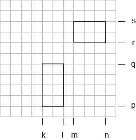{width="2.696527777777778in"
height="2.7784722222222222in"}

**Fig. A2-1:** Schematic representation of the regions on a CCD chip
which were used for the derivation of the generalized cross-correlation
functions of ITIR-FCCS.

The function was originally derived in ref \[1\]:


#  {#section .unnumbered}

# Annex 3: Mean Square Displacement {#annex-3-mean-square-displacement .unnumbered}

For the sake of simplicity for the derivation, the following definition
of is used ignoring
. In the case of SPIM-FCS

 , where
Hence 


This equation needs to be solved for \
Substituting,and
 sequentially, we get


, where 

Taylor series expansion yielded a diverging series. Hence a Pade
approximation was used. The function used in Mathematica^©^ is called
PadeApproximinant. The details of the function can be found here
(<http://reference.wolfram.com/language/ref/PadeApproximant.html>). A
discussion on the effectiveness of Pade Approximation in Math overflow
is found here
(<http://mathoverflow.net/questions/122539/the-unreasonable-effectiveness-of-pade-approximation>).
The article explaining Pade Approximation in Wikipedia can be accessed
here. (<http://en.wikipedia.org/wiki/Pad%C3%A9_approximant>).

Terms up to order 5 were needed to approximate the function. The
relative error between the approximation and the original function is
0.7%.

Performing a Pade approximation for  using
Mathematica^©^, we get 


 and 

This polynomial in *x* is solved using a
Brent solver. The upper bound of *x* at *t*=0 is
. The lower bound of *x* as t tends to ∞
is 0. Hence the Brent solver is programmed with these two limits.

The solution obtained for *x* is back transformed to
yield. This value is multiplied by 1.5 to
yield the mean squared displacement in 3D
() since these samples are in 3D.

**TIRF approximation**

Similar to the SPIM case, in the case of TIRF,
 where

Hence \


This equation needs to be solved for \
Substituting


Where 

Performing a Taylor series expansion of up to power 8 of


yields 

The relative error between the approximation and the original function
is less than 0.5%.


Substitute 


This equation is quartic in *t* and a solver has been implemented based
on the algorithm provided in IgorPro 6 (Wavemetrics^©^) to solve for *t*
(solvequartic and getonecubicroot functions). The obtained values of *t*
are later used to calculate *x* which yields the value of *x* later.

# Annex 4: Simulation {#annex-4-simulation .unnumbered}

The simulation module offers the opportunity to simulate different
situations and test the results against real measurements. At the moment
it offers 2D and 3D simulations for ITIR-FCS and SPIM-FCS situations. A
number of the simulation parameters are taken from the ImFCS panel. This
includes pixel size, the NA, magnification, wavelength, and PSF and
light sheet thickness (see lateral and axial PSF). Other parameters can
be directly controlled in the simulation panel.

{width="3.8055555555555554in"
height="3.3055555555555554in"}

**Mode:** Diffusive modes to be simulated (2D, 3D, free, domain
trapping, hop diffusion).

**Triplet:** A triplet can be included in the simulations, although a
triplet can be seen in measurements only for very fast array detectors.

**Seed**: Seed for the random number generator. This ensures
reproducibility. Has to be an integer.

**Particle \#**: The number of particles to be simulated. Has to be an
integer.

**CPS**: Counts per Particle and Second; this provides a measurement for
the brightness of the probes. Has to be an integer.

**Bleach Time**: Average bleaching time to simulate photobleaching. This
is determined by an exponential Exp\[-t/bleachtime\].

**Pixel \#**: The pixel number n provides the dimension of the detection
area (n×n). At the moment only square areas are allowed. Has to be an
integer.

**Extension**: The factor by which the simulated area is larger than the
detection area.

**Frame \#**: number of frames to be simulated. Has to be an integer.

**Time res**: This is the frame time.

**Steps per frame:**

**Step Size \[nm\]**

**D1, D2, D3**: diffusion coefficients in um2/s of up to 3 components.

**F2, F3**: fraction of the last two components (has to be between 0 and
1). F1 = 1 - F2 - F3. Please note that as the number of particles must
be an integer, the values F1\*N, F2\*N, F3\*N, have to be rounded. When
simulating many particles this effect will be negligible. But when
simulating few particles it can lead to slight deviations.

**Dout/Din:** If domains are simulated this provides the ratio between
the diffusion coefficient outside and the inside of domains.

**Camera offset**: A constant offset for the camera.

**Camera noise factor**: Mean of Poisson Generated Noise

**FRAP Radius**: Only available in 2D. Radius of a circular area to be
bleached in the centre of the image.

**FRAP Frame**: Only available in 2D. Frame at which bleaching happens.
Bleaching is instantaneous.

**Dom Rad \[nm\]:** Average domain radius. The program creates domains
with this value as average and a10% standard deviation in sizes. *[Note:
The system can only simulate domain sizes that are smaller than 3 times
the pixel size. For larger domains the results will be
incorrect.]{.underline}*

**Dom Density:** Number of domains per μm^2^.

**Pin, Pou:** Probability to enter or exit a domain.

**MeshSize \[nm\]:** If a meshwork is simulated this is the mesh size.
At the moment only square meshes are allowed.

**Hop Prob:** Probability to hop over a barrier in a meshwork.

**Batch:** Allows to produce multiple simulations. At the moment this
allows only a variation of D, D2 and F2. This will be further extended
in the future.

The simulator also offers to plot the coordinates of one of the
particles in the log window. The format is:

{{x1, y1}, {x2, y2),...{xn, yn},}

For that purpose after the start of the simulation a dialog window is
opened where the number of the particle, for which the coordinates are
to be plotted, can be provided. The default is -1, which means no
particle. Putting a number in between 0 and the number of particles
simulated minus 1 will then results in the coordinates to be printed in
the log window. This is a temporary measure to allow users to have
access and check some of the trajectories.

***Note**: Use this feature with care as the printout slows down the
simulations and can lead to large printout lists. We suggest to use not
more than 1000 values to print out, e.g. simulate 100 frames with 10
steps per frame.*

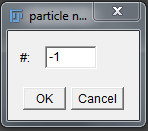{width="1.4828248031496063in"
height="1.3125in"}

Simulation output: The user can choose one particle for which the
coordinates are printed out in the log window.

**Example trajectories of simulations:**

***Free Diffusion***

{width="1.9166666666666667in"
height="2.007176290463692in"}

***Domain Diffusion***

Large field of view (\~2 um) small field of view (\~400 nm)

{width="2.1979166666666665in"
height="1.8089588801399825in"}{width="2.095469160104987in"
height="1.7986111111111112in"}

***Meshwork Diffusion***

{width="2.0104166666666665in"
height="2.0104166666666665in"}

# References {#references .unnumbered}

1\. Sankaran, J., M. Manna, L. Guo, R. Kraut, and T. Wohland. 2009.
Diffusion, Transport, and Cell Membrane Organization Investigated by
Imaging Fluorescence Cross-Correlation Spectroscopy. Biophysj. 97:
2630--2639.

2\. He, J., S.-M. Guo, and M. Bathe. 2012. Bayesian Approach to the
Analysis of Fluorescence Correlation Spectroscopy Data I: Theory. Anal
Chem. 84: 3871--3879.

3\. Guo, S.-M., J. He, N. Monnier, G. Sun, T. Wohland, and M. Bathe.
2012. Bayesian Approach to the Analysis of Fluorescence Correlation
Spectroscopy Data II: Application to Simulated and In Vitro Data. Anal
Chem. 84: 3880--3888.

4\. Guo, S.-M., N. Bag, A. Mishra, T. Wohland, and M. Bathe. 2014.
Bayesian Total Internal Reflection Fluorescence Correlation Spectroscopy
Reveals hIAPP-Induced Plasma Membrane Domain Organization in Live Cells.
Biophysj. 106: 190--200.

5\. Bag, N., J. Sankaran, A. Paul, R.S. Kraut, and T. Wohland. 2012.
Calibration and limits of camera-based fluorescence correlation
spectroscopy: a supported lipid bilayer study. ChemPhysChem. 13:
2784--2794.

6\. Wawrezinieck, L., H. Rigneault, D. Marguet, and P.-F. Lenne. 2005.
Fluorescence correlation spectroscopy diffusion laws to probe the
submicron cell membrane organization. Biophysj. 89: 4029--4042.

7\. Brinkmeier, M., K. Dörre, J. Stephan, and M. Eigen. 1999. Two-beam
cross-correlation:  a method to characterize transport phenomena in
micrometer-sized structures. Anal Chem. 71: 609--616.

8\. Przybylski, A., B.X.R. Thiel, J. Keller-Findeisen, B. Stock, and M.
Bates. 2017. Gpufit: An open-source toolkit for GPU-accelerated curve
fitting. Sci. Rep. : 1--9.

9\. Wohland, T., R. Rigler, and H. Vogel. 2001. The standard deviation
in fluorescence correlation spectroscopy. Biophys J. 80: 2987--2999.

10\. Sankaran, J., N. Bag, R.S. Kraut, and T. Wohland. 2013. Accuracy
and Precision in Camera-Based Fluorescence Correlation Spectroscopy
Measurements. Anal Chem. 85: 3948--3954.

11\. Macháň, R., Y.H. Foo, and T. Wohland. 2016. On the Equivalence of
FCS and FRAP: Simultaneous Lipid Membrane Measurements. Biophysj. 111:
152--161.

12\. Freedman, D., and P. Diaconis. 1981. On the Histogram as a Density
Estimator: L2 Theory. Probab. Theory and Relat. Fields. : 453--476.

13\. Krieger, J.W., A.P. Singh, C.S. Garbe, T. Wohland, and J.
Langowski. 2014. Dual-Color Fluorescence Cross-Correlation Spectroscopy
on a Single Plane Illumination Microscope (SPIM-FCCS). Opt Express. 22:
2358.

14\. Bag, N., X.W. Ng, J. Sankaran, and T. Wohland. 2016. Spatiotemporal
mapping of diffusion dynamics and organization in plasma membranes.
Methods Appl. Fluoresc. : 1--15.

15\. Shusterman, R., S. Alon, T. Gavrinyov, and O. Krichevsky. 2004.
Monomer Dynamics in Double- and Single-Stranded DNA Polymers. Phys. Rev.
Lett. 92: 048303.

16\. Unruh, J.R., and E. Gratton. 2008. Analysis of Molecular
Concentration and Brightness from Fluorescence Fluctuation Data with an
Electron Multiplied CCD Camera. Biophysj. 95: 5385--5398.

17\. Ries, J., S. Chiantia, and P. Schwille. 2009. Accurate
Determination of Membrane Dynamics with Line-Scan FCS. Biophysj. 96:
1999--2008.

18\. Hirsch, M., R.J. Wareham, M.L. Martin-Fernandez, M.P. Hobson, and
D.J. Rolfe. 2013. A stochastic model for electron multiplication
charge-coupled devices\--from theory to practice. PLoS ONE. 8: e53671.

19\. Guo, L., J.Y. Har, J. Sankaran, Y. Hong, B. Kannan, and T. Wohland.
2008. Molecular Diffusion Measurement in Lipid Bilayers over Wide
Concentration Ranges: A Comparative Study. ChemPhysChem. 9: 721--728.

20\. Ries, J., E.P. Petrov, and P. Schwille. 2008. Total Internal
Reflection Fluorescence Correlation Spectroscopy: Effects of Lateral
Diffusion and Surface-Generated Fluorescence. Biophys J. 95: 390--399.

21\. Wohland, T., X. Shi, J. Sankaran, and E. Stelzer. 2010. Single
plane illumination fluorescence correlation spectroscopy (SPIM-FCS)
probes inhomogeneous three-dimensional environments. Opt Express. 18:
10627--10641.

22\. Sankaran, J., X. Shi, L.Y. Ho, E.H.K. Stelzer, and T. Wohland.
2010. ImFCS: a software for imaging FCS data analysis and visualization.
Opt Express. 18: 25468--25481.

23\. Singh, A.P., J.W. Krieger, J. Buchholz, E. Charbon, J. Langowski,
and T. Wohland. 2013. The performance of 2D array detectors for light
sheet based fluorescence correlation spectroscopy. Opt Express. 21:
8652.

24\. Thompson, N.L. 1991. Fluorescence correlation spectroscopy. In:
Lakowicz JR, editor. Topics in Fluorescence Spectroscopy, Vol. 1:
Techniques. New York: Plenum Press. pp. 337--378.

25\. Balasubramanian, H., Sankaran, J., Pandey, S., Goh, C. J. H. &
Wohland, T. 2022. The dependence of EGFR oligomerization on environment
and structure: A camera-based N&B study. Biophys J. **121**, 4452--4466.

\- END OF DOCUMENT -

[^1]: This document does not explain the theory of correlation analysis
    but is only concerned with the use of the Imaging FCS plugin. For
    details on the theory please see the references.

[^2]: Note, if you want to compile the program yourself from the Java
    source code you will need to install "commons-math3-3.6.1" in the
    jars folder of Fiji (\\Fiji.app\\jars) and possibly remove the older
    "commons-math3-3.2". You can download this jar file at
    <http://commons.apache.org/proper/commons-math/download_math.cgi> .
    In addition, you will need to install the Apache POI poi-3.17 in the
    jars folder of Fiji. Poi-3.17 can be downloaded at
    <https://poi.apache.org/download.html>.

[^3]: We have limited iterations and evaluations to 2000 in the program
    as that was a good compromise and reaching fits for the most number
    of pixels without taking too much time for the fit. This can be
    changed in the Java file by changing the variables
    "fitMaxIterations" And "fitMaxEvaluations".

[^4]: If blocking is not successful, i.e. the standard deviation does
    not converge to a stable value, this typically indicates that the
    measurements weren't sufficiently long and noise correlations exist
    for times longer than the correlation times. In this case so-called
    maximal blocking will be used as described in the cited article.
